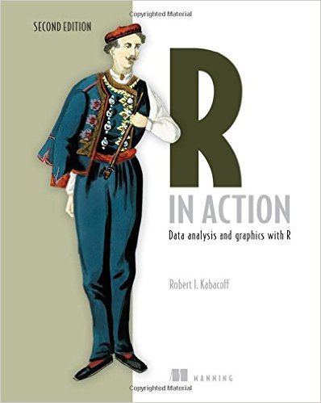
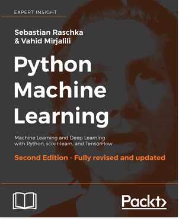
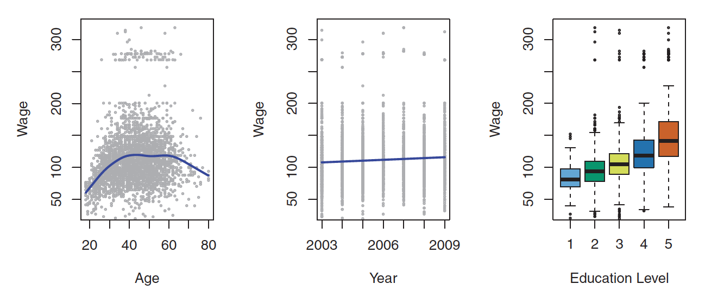

<style>
.title-slide {
  background-color: #FFFFFF; /* #EDE0CF; ; #CA9F9D*/
}
slide:not(.segue) h2 {
  color: #800000
}
slide pre code {
  font-size: 11px ;
}
slide.linkage li {
  font-size: 80%;
}
slide.eighty li {
  font-size: 80%;
}
img[alt=book_islr] {
  height: 400px;
}
img[alt=book_eslr] {
  height: 400px;
}
img[alt=book_data_computing] {
  height: 300px;
}
img[alt=book_r_in_action] {
  height: 300px;
}
img[alt=python_machine_learning] {
  height: 400px;
}
</style>

```{r setup, include=FALSE}
knitr::opts_chunk$set(echo = TRUE)
```

## Scope

* Machine Learning Theory (light!)
* Understand when to use different algorithms
* Focus on traditional machine learning to begin with
  + Build up for understanding deep learning theory
* Learn how to implement machine learning algorithms
* Open ended, consider contributing!

--- &twocol .eighty
## R Books

*** =left


*** =right


---
## Books

* An Introduction to Statistical Learning with Applications in R (ISLR)
    + Focused on applying statistical learning
    + Our primary book for the meetups
    + Available at http://www-bcf.usc.edu/~gareth/ISL/
* The Elements of Statistical Learning (ESL)
    + Provides the theory
    + We may use this for some deeper dives
    + Available at http://statweb.stanford.edu/~tibs/ElemStatLearn/

---    
## Getting and Using R

* Download and install R
    + https://www.cran.r-project.org
* Download and install RStudio
    + https://www.rstudio.com/products/rstudio/download/

---    
## Why R?

* Because ISLR!
* I believe it's the best environment for learning the concepts of machine learning
  + R + RStudio are free and open source and easy to use
* Concepts can be *directly* applied to other environments, particularly Python
* We're all programmers and my experience tells me you won't have a problem with learning R!

---    
## Modern R

* Hadley Wickham, "The Hadleyverse"
    + ggplot2
    + dplyr
    + tidyr

---    
## Learning R

* Data Computing
    + http://data-computing.org
* Covers modern R!


---    
## Learning R

* R in Action
    + https://www.manning.com/books/r-in-action-second-edition



---
## Python Books



---
## Python Frameworks

* Scikit-learn, SciPy, NumPy
* Pandas
* Matplotlib, Seaborn
* TensorFlow, PyTorch

---
## Jupyter

* Web-based interactive notebooks
* Create reproducible experiements and tutorials
* "Share" them with others
* We'll have a JupyterHub service so you don't have to install and maintain Jupyter yourself

---    
## Goals of the Data Science Meetup

* Have fun!
    + Forum for taking risks
* Learn about the topic of machine learning
* ISLR is not the end

---    
## Structure of the Data Science Meetup

* Structured sessions
    + Interaction encouraged
* Presentations availble on public github
    + At https://github.com/craigching/datascience-course
* Regular sessions and will be recorded
* Labs
    + Volunteer to present?
* Open ended

---    
## Introduction to Statistical Learning



---    
## Exploring Data

* Quantitative/continuous values
    + Age
    + Wage
* Qualitative/categorical values
    + Education level
    + Stock movement (up, down)
    + Low, medium, high (ordered categorical)

---    
## History of Statistical Learning

* Method of Least Squares
    + Legendre, Gauss beginning 19th century
    + Basis of linear regression
    + Predict quantitative values
* Linear Discriminant Analysis
    + Fisher, 1936
    + Predict qualitative values
* Logistic Regression
    + Various, 1940's
    + Alternative to LDA
* Generalized Linear Models
    + Nelder and Wedderburn, early 1970's

---    
## ISLR Premises

* Many statistical learning methods are relevant and useful in a wide
range of academic and non-academic disciplines, beyond just the statistical
sciences
* Statistical learning should not be viewed as a series of black boxes
* While it is important to know what job is performed by each cog, it
is not necessary to have the skills to construct the machine inside the
box!
* We presume that the reader is interested in applying statistical learning
methods to real-world problems
