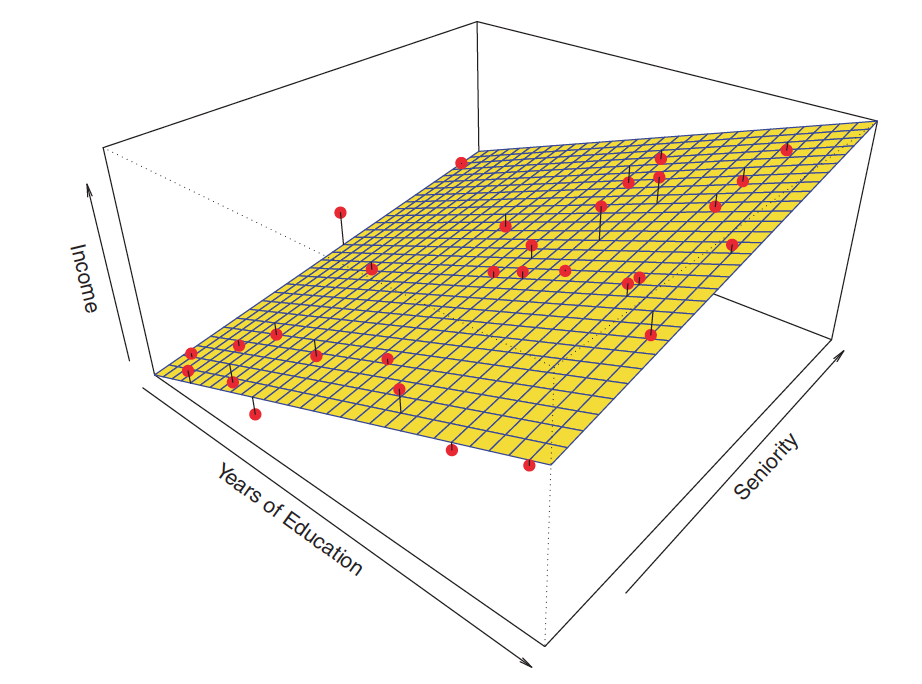
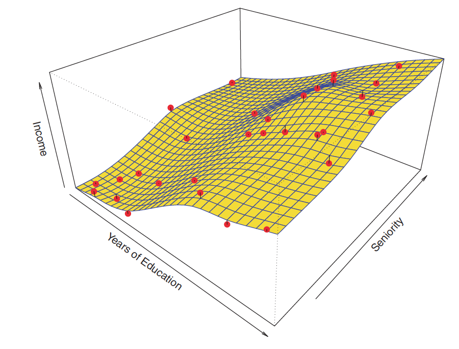
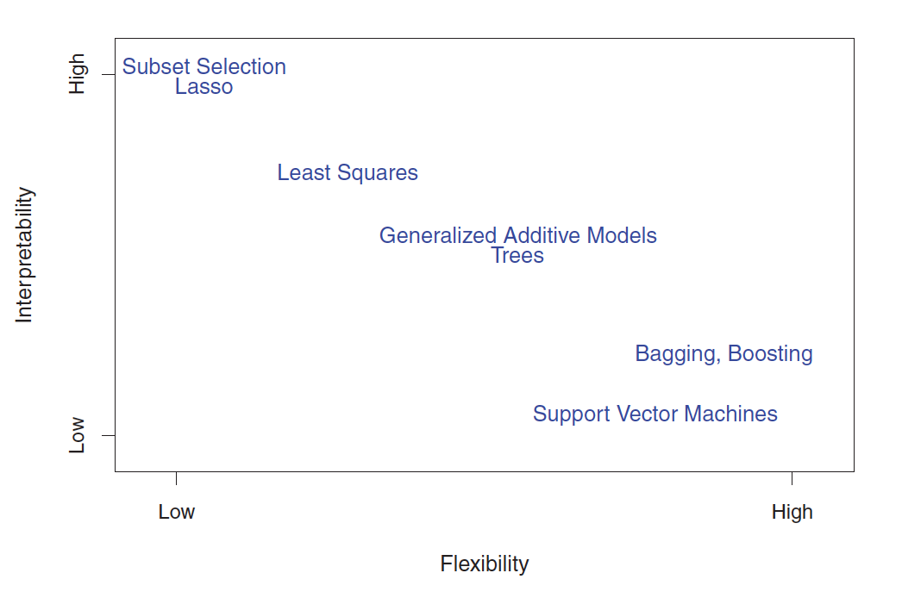
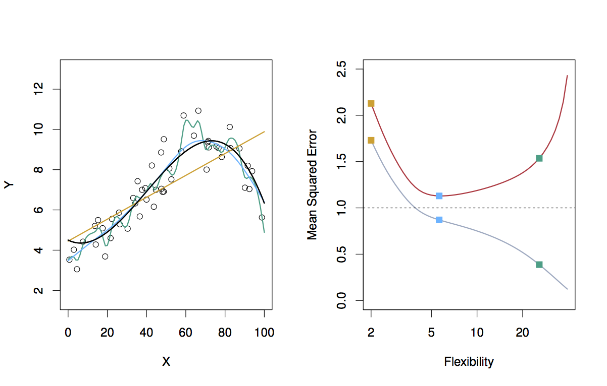
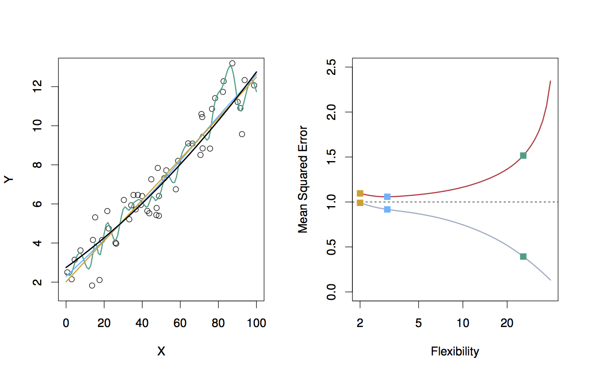
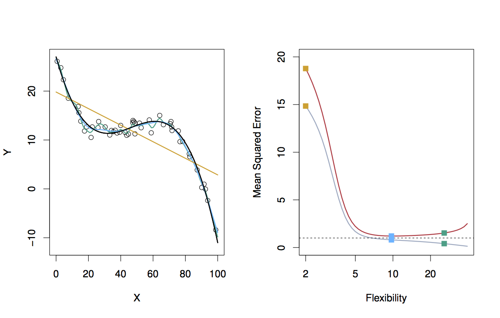
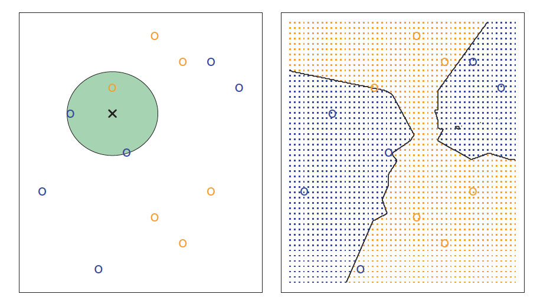
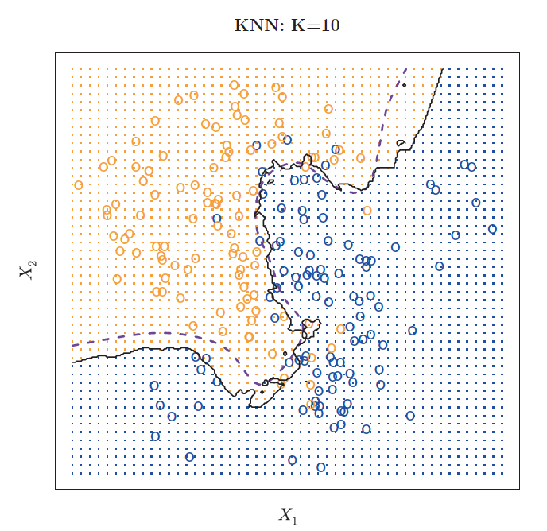
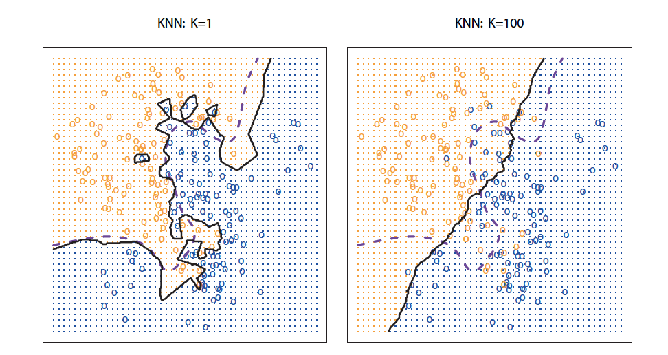

<style>
.title-slide {
  background-color: #FFFFFF; /* #EDE0CF; ; #CA9F9D*/
}
slide:not(.segue) h2 {
  color: #800000
}
slide pre code {
  font-size: 11px ;
}
slide.linkage li {
  font-size: 80%;
}
slide.eighty li {
  font-size: 80%;
}
img[alt=true_function] {
  height: 400px;
}
img[alt=linear_model] {
  height: 400px;
}
img[alt=true_function] {
  height: 400px;
}
img[alt=smooth_thin_plate_spline_fit] {
  height: 400px;
}
img[alt=accuracy_vs_interpretability] {
  height: 400px;
}
img[alt=knn] {
  height: 400px;
}
img[alt=knn_10] {
  height: 400px;
}
img[alt=knn_1_and_100] {
  height: 400px;
}
img[alt=fig_2_9] {
  height: 400px;
}
img[alt=fig_2_10] {
  height: 400px;
}
img[alt=fig_2_11] {
  height: 400px;
}
</style>

```{r setup, include=FALSE}
knitr::opts_chunk$set(echo = TRUE)
```

## What is Statistical Learning?

* Independent/Input variables, Predictors, Features
* Dependent/Output variable, Response

Finding a relationship between Independent and Dependent variables

$Y = f(X) + \epsilon$

Statistical learning is a set of approaches for estimating $f$

---
## Estimating $f$

* Why?
    + Prediction
    + Inference

---
## Prediction

$\hat{Y} = \hat{f}(X)$

* For prediction $\hat{f}$ may be considered a black box, provided that it yields accurate predictions for $Y$

---
## Prediction - Error

$E(Y - \hat{Y})^2 = [f(X) - \hat{f}(X)]^2 + Var(\epsilon)$

* Reducible Error
    + The accuracy of $\hat{f}$ can be improved by using the most appropriate statistical learning technique
* Irreducible Error
    + $Y$ is also a function of $\epsilon$ which can't be predicted by $X$
    + Variability associated with $\epsilon$ affects the accuracy of our predictions
    
"The focus of this book is on techniques for estimating f with the aim of minimizing the reducible error"

---
## Inference

* Want to understand the relationship between $X$ and $Y$
* $f$ cannot be treated as a black box
* Want to answer the following questions:
    + Which predictors are associated with the response?
    + What is the relationship between the response and each predictor?
    + Can the relationship between Y and each predictor be adequately summarized using a linear equation, or is the relationship more complicated?

Sometimes the goal is prediction, sometimes it's inference and sometimes it's a combination of the two

---
## Estimating $f$

* How?
    + Parametric
    + Non-parametric

What are the advantages and disadvantages of each?

* Parametric models reduce the problem of estimating $f$ down to estimating a set of parameters
  + Linear models, $Y \approx \beta_0 + \beta_1 X_1 + \beta_2 X_2 + ... + \beta_p X_p$
* Non-parameteric models do not reduce the problem of estimating $f$ to a small number of parameters and, thus, require far more observations for an accurate estimate of $f$

---
## True Model


Figure 2.3 in the book represents the *true* model of the data.

---
## Parametric Model



Figure 2.4 is a linear model of the data which represents a parametric approach.

---
## Non-Parametric Model




Figure 2.5 shows a smooth thin-plate spline model of the data which represents a non-parametric approach.
  + Notice the increased variability in the fit compared to the true model!

---
## Prediction Accuracy vs. Interpretability




---
## Supervised vs. Unsupervised Learning

* Supervised Learning
	+ Fit a model that relates the response to the predictors
	+ Linear regression, logistic regression, GAM, boosting, support vector machines
* Unsupervised Learning
	+ Vector of measurements but no response
	+ Lack a response variable that can supervise our analysis
	+ Cluster analysis
* Semi-supervised Learning
	+ May be some criteria within the data that allows a supervised method if defined

---
## Regression vs. Classification

* Problems where we want to predict quantitative responses are referred to as *regression* problems
* Problems where we want to predict qualitative responses are referred to as *classification* problems

Choose based on the type of the *response* variable, the *predictors* are generally considered less important and can work with most learning methods regardless of the predictor variable type provided that any qualitative predictors are properly *coded* before any analysis is performed

---
## Assessing Model Accuracy

* Why so many methods?
	+ No one method dominates over all data sets

Must decide which method performs the best for any given data set

---
## Measuring Quality of Fit

For regression:

$MSE = \frac{1}{n}\sum_{i=1}^n (y_i - \hat{f}(x_i))^2$

* Must use caution when determining quality of fit using the training data set
* Sometimes a test data set is not available

"We are interested in the accuracy of the predictions that we obtain when we apply our method to previously unseen test data"

* Later chapters describe techniques to overcome these limitations, for instance, cross-validation
* Review Figures 2.9, 2.10 and 2.11

---
## Figure 2.9



---
## Figure 2.10



---
## Figure 2.11



---
##  Overfitting

* When a given method yields a small training MSE, but a large test MSE
* "When we overfit the training data, the test MSE will be very large because the supposed patterns that the method found in the training data simply don't exist in the test data"
* Note that we do expect the training MSE to be smaller than the test MSE because most learning methods either directly or indirectly seek to minimize the MSE

---
## Bias Variance Trade-off

$E(y_0 - \hat{f}(x_0))^2 = Var(\hat{f}(x_o)) + [Bias(\hat{f}(x_0))]^2 + Var(\epsilon)$

* Variance
	+ *Variance* refers to the amount by which $\hat{f}$ would change if we estimated it using a different training data set
	+ Generally, more flexible methods have higher variance
* Bias
	+ *Bias* refers to the error that is introduced by approximating a real-life problem, which may be extremely complicated, by a much simpler model
	+ Generally, more flexible methods result in less bias

As a general rule, as we use more flexible methods, the variance will increase and the bias will decrease

---
## Classification

* Most concepts from regression apply to classification with some modifications due to the fact that $y_i$ is no longer numerical (it is categorical)
* Training error rate

$\frac{1}{n}\sum_{i=1}^nI(y_i \neq \hat{y_i})$

* Test error rate

$Ave(I(y_0 \neq \hat{y_0}))$

* A *good* classifier is one for which the test error is smallest

---
## The Bayes Classifier

* The Bayes classifier:

$Pr(Y = j | X = x_0)$

* is a *conditional probability*
* Establishes the *Bayes decision boundary*
* Bayes error rate

$1 - E(max_j Pr(Y = j|X))$

* Analogous to the irreducible error in regression
* Used as a benchmark in classification

---
## K Nearest Neighbors



* Classify based on K nearest neighbors
* KNN decison boundary

---
## K Nearest Neighbors

* K == 10, compares favorably with the Bayes decision boundary



---
## K Nearest Neighbors

* K == 1 and K == 100



* K == 1, overfit, overly flexible
* K == 100, almost linear, not sufficiently flexible

---
## Pop Quiz!

Adam said he wants this as feedback for your performance review! (I'm making that up)

--- &radio

## Parametric vs. Non-Parametric

Is KNN a parametric or a non-parametric algorithm?

1. Parametric
2. _Non-Parametric_

*** .explanation

KNN is a non-parametric algorithm.  The "fit" process does nothing, during prediction, the given point on which to predict is simply compared to the nearest neighbors in the dataset.  Non-parametric algorithms are sometimes called "lazy" for this reason and they can be memory hungry due to having to keep all the data around to perform predictions.

--- &radio

## Mean Squared Error

MSE seems like it exaggerates the predictions that are wrong.  Is this a feature or a bug?

1. _Feature_
2. Bug

*** .explanation

It is a feature when used appropriately.  Note that in neural networks and deep learning, such errors can have a negative effect on learning performance and other means are employed to keep the error from growing too high in the presence of mis-predictions.

--- &radio

## Bias-Variance Tradeoff vs. Overfitting

I first tried a linear model and both my training error and test error were bad.  I then tried a smoothing spline, but, this time I nailed my training error, but my test error was still bad.  What problem am I facing?

1. Bias-Variance Tradeoff
2. Overfitting
3. _Both_
4. Something else

*** .explanation

This is the situation in figure 2.9.  The linear model suffered from bias, the true function was not linear, so neither the training error nor the test error were good.  The high degree spline model suffered from overfitting on the training data, but poor performance on test data.  The right model to use is something that doesn't fit the training set quite as well so that it can generalize to unseen data better.
