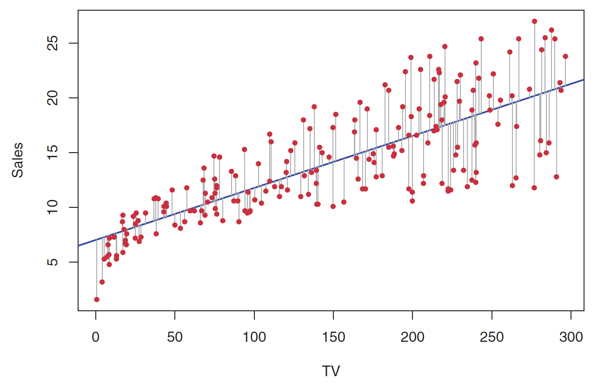

```{r setup, include=FALSE}
knitr::opts_chunk$set(echo = FALSE)
```

## Recap

* Why Statistical Learning?
* Supervised vs. Unsupervised Learning
* Regression vs. Classification
* Assessing Model Accuracy
* Overfitting and Bias-Variance Tradeoff

## Bias Variance Trade-off

$E(y_0 - \hat{f}(x_0))^2 = Var(\hat{f}(x_o)) + [Bias(\hat{f}(x_0))]^2 + Var(\epsilon)$

* Variance
	+ *Variance* refers to the amount by which $\hat{f}$ would change if we estimated it using a different training data set
	+ Generally, more flexible methods have higher variance
* Bias
	+ *Bias* refers to the error that is introduced by approximating a real-life problem, which may be extremely complicated, by a much simpler model
	+ Generally, more flexible methods result in less bias

As a general rule, as we use more flexible methods, the variance will increase and the bias will decrease

## Linear Regression

* Simple approach to supervised learning

"... the importance of having a good understanding of linear regression before studying more complex learning methods cannot be overstated."

## Important Questions

Recalling the Advertising data from Chapter 2:

1. Is there a relationship between advertising budget and sales?
2. How strong is the relationship between advertising budget and sales?
3. Which media contribute to sales?
4. How accurately can we estimate the effect of each medium on sales?
5. How accurately can we predict future sales?
6. Is the relationship linear?
7. Is there synergy among the advertising media?

## Simple Linear Regression

* Predict quantitative responses from a single predictor variable

$Y \approx \beta_0 + \beta_1X$

* $\beta_0$ is the intercept
* $\beta_1$ is the slope
* $\beta_0$ and $\beta_1$ are the model *coefficents* or *parameters*

Use training data to produce estimates $\hat{\beta_0}$ and $\hat{\beta_1}$ for the model coefficients, then:

$\hat{y} = \hat{\beta_0} + \hat{\beta_1}x$

can be used for prediction

## Estimating the Coefficients

* Amounts to finding a line of *best fit*
* Use the data to *train* a *model*

## Least Squares

* Residuals

$\hat{y_i} = \hat{\beta_0} + \hat{\beta_1}x_i$ is our prediction for $Y$ based on the *i*th value of $X$.  Then $e_i = y_i - \hat{y_i}$ is the *i*th *residual*

* Residual Sum of Squares (RSS)

$RSS = e_1^2 + e_2^2 + ... + e_n^2$

* Choose $\beta_0$ and $\beta_1$ to minimize RSS

$\hat{\beta_1} = \frac{\sum_{i = 1}^{n}(x_i - \bar{x})(y_i - \bar{y})}{\sum_{i = 1}^{n}(x_i - \bar{x})^2}$

$\hat{\beta_0} = \bar{y} - \hat{\beta_1}\bar{x_i}$

## Least Squares Illustrated

```{r, out.width = 600, fig.retina = NULL}

```

$\hat{y} = 7.03 + 0.0475x$

## R Demonstration

## Assessing Accuracy of the Coefficient Estimates

## Assessing Model Accuracy

## $R^2$ Statistic


