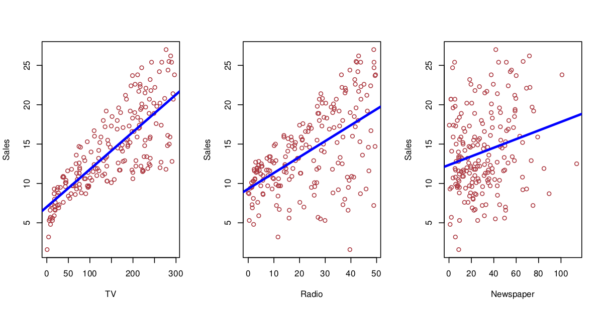
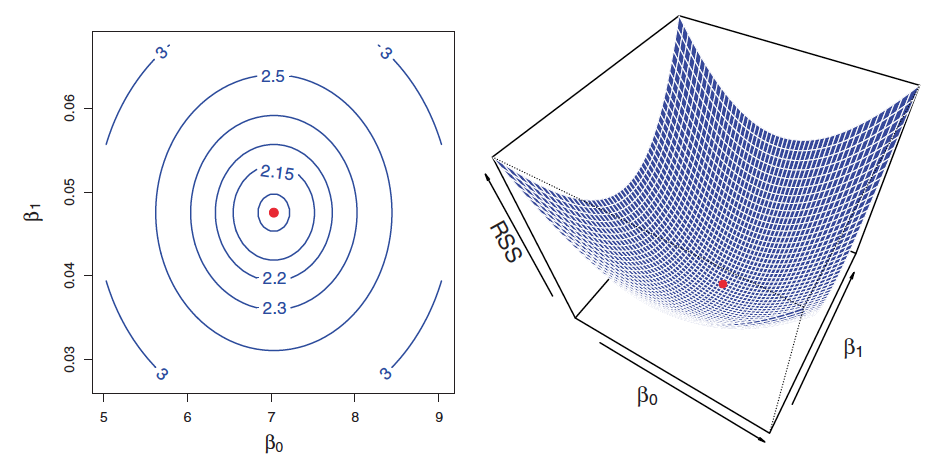
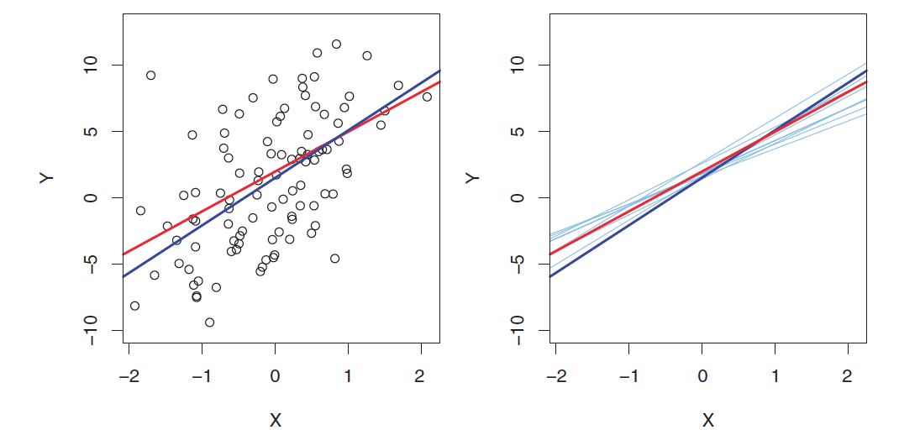
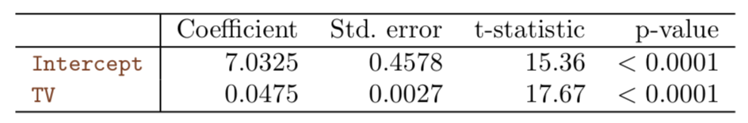

<style>
.title-slide {
  background-color: #FFFFFF; /* #EDE0CF; ; #CA9F9D*/
}
slide:not(.segue) h2 {
  color: #800000
}
slide pre code {
  font-size: 11px ;
}
slide.linkage li {
  font-size: 80%;
}
slide.eighty li {
  font-size: 80%;
}
img[alt=advertising_least_squares] {
  height: 400px;
}
img[alt=least_squares_minimization] {
  height: 400px;
}
img[alt=least_squares] {
  height: 400px;
}
img[alt=pop_regression_line] {
  height: 300px;
}
img[alt=least_squares_quiz] {
  height: 200px;
}
</style>

```{r setup, include=FALSE}
knitr::opts_chunk$set(echo = TRUE)
```

## Recap

* Why Statistical Learning?
* Supervised vs. Unsupervised Learning
* Regression vs. Classification
* Assessing Model Accuracy
* Overfitting and Bias-Variance Tradeoff

---
## The Advertising Dataset



* Sales in thousands of units as a function of budget in thousands of dollars
* The blue line shows the **least squares** fit of sales to variable

---
## Linear Regression

* Simple approach to supervised learning

"... the importance of having a good understanding of linear regression before studying more complex learning methods cannot be overstated."

---
## Important Questions

Given the Advertising data:

1. Is there a relationship between advertising budget and sales?
2. How strong is the relationship between advertising budget and sales?
3. Which media contribute to sales?
4. How accurately can we estimate the effect of each medium on sales?
5. How accurately can we predict future sales?
6. Is the relationship linear?
7. Is there synergy among the advertising media?

---
## Simple Linear Regression

* Predict quantitative responses from a single predictor variable

$Y \approx \beta_0 + \beta_1X$

* We can regress $sales$ onto $TV$ by fitting the model:

$sales \approx \beta_0 + \beta_1 \times TV$

* $\beta_0$ is the intercept
* $\beta_1$ is the slope
* $\beta_0$ and $\beta_1$ are the model *coefficents* or *parameters*

Use training data to produce estimates $\hat{\beta_0}$ and $\hat{\beta_1}$ for the model coefficients, then:

$\hat{y} = \hat{\beta_0} + \hat{\beta_1}x$

can be used for prediction

---
## Estimating the Coefficients

* In practice, $\beta_0$ and $\beta_1$ are unknown, so we use the data to estimate the coefficients
* Given a data set:

$(x_1, y_1), (x_2, y_2) \dots (x_n, y_n)$

* Our goal is to find coefficient estimates $\hat{\beta_0}$ and $\hat{\beta_1}$ such that the linear model fits the data well

* Amounts to finding a line of *best fit*
* Use the data to *train* a *model*

---
## Least Squares

* Residuals

$\hat{y_i} = \hat{\beta_0} + \hat{\beta_1}x_i$ is our prediction for $Y$ based on the $i$th value of $X$.  Then $e_i = y_i - \hat{y_i}$ is the $i$th *residual*

* Residual Sum of Squares (RSS)

$RSS = e_1^2 + e_2^2 + ... + e_n^2$

* Equivalently

$RSS = (y_1 - \hat{\beta_0} - \hat{\beta_1}x_1)^2 + (y_2 - \hat{\beta_0} - \hat{\beta_1}x_2)^2 + \dots (y_n - \hat{\beta_0} - \hat{\beta_1}x_n)^2$

* Choose $\beta_0$ and $\beta_1$ to minimize RSS

$\hat{\beta_1} = \frac{\sum_{i = 1}^{n}(x_i - \bar{x})(y_i - \bar{y})}{\sum_{i = 1}^{n}(x_i - \bar{x})^2}$

$\hat{\beta_0} = \bar{y} - \hat{\beta_1}\bar{x_i}$

---
## Least Squares Minimization



---
## Linear Regression for Advertising Data

* $sales \approx 7.03 + 0.0475TV$
* Interpretation: "An additional $1,000 spent on TV advertising is associated with selling approximately 47.5 additional units of the product."

---
## Least Squares Illustrated


$\hat{y} = 7.03 + 0.0475x$

---
## The Population Regression Line



True model based on $f(X) = 2 + 3X$, red line represents true relationship, dark blue line is the least squares estimate, light blue lines are least squares lines from different data sets

* Least squares lines are, on average, close to the population regression line
* Example of Variance in "Bias Variance Tradeoff"

---
## Assessing Accuracy of the Coefficient Estimates

* Average amount that the coefficients $\hat{\beta_0}$ and $\hat{\beta_1}$ differ from the true coefficients $\beta_0$ and $\beta_1$

* Similar to computing standard errors for point estimates of $\mu$, the point estimate for the population mean

* Assume errors $\epsilon_i$ for each observation are uncorrelated with common variance $\sigma^2$ (Not true in figure 3.1!)

$SE(\hat{\beta_0})^2 = \sigma^2\Big[\frac{1}{n} + \frac{\bar{x}^2}{\sum_{i = 1}^{n}(x_i - \bar{x})^2}\Big]$

$SE(\hat{\beta_1})^2 = \frac{\sigma^2}{\sum_{i = 1}^{n}(x_i - \bar{x})^2}$

---
## Confidence Intervals for Coefficient Estimates

$\beta_1 \pm 2 * SE(\hat{\beta_1})$

$\beta_0 \pm 2 * SE(\hat{\beta_0})$

$[\hat{\beta_1} - 2 * SE(\hat{\beta_1}), \hat{\beta_1} + 2 * SE(\hat{\beta_1})]$

"In the case of the advertising data, the 95% confidence interval for $\beta_0$ is [6.130, 7.935] and the 95% confidence interval for $\beta_1$ is [0.042, 0.053]. Therefore, we can conclude that in the absence of any advertising, sales will, on average, fall somewhere between 6,130 and 7,940 units. Furthermore, for each $1,000 increase in television advertising, there will be an average increase in sales of between 42 and 53 units."

---
## Hypothesis Tests for Cofficient Estimates

* Standard errors can also be used to perform hypothesis tests on the coefficients

$H_0 :$ There is no relationship between $X$ and $Y$

$H_a :$ There is some relationship between $X$ and $Y$

Mathematically:

$H_0 : \beta_1 = 0$

$H_a : \beta_1 \neq 0$

---
## The *t* Statistic for the Coefficient Estimates

* Measures the number of standard deviations that $\hat{\beta_1}$ is away from 0
* Probability of observing any value equal to |$t$| or larger, assuming $\beta_1 = 0$, *p-value*

$t = \frac{\hat{\beta_1} - 0}{SE(\hat{\beta_1})}$



---
## Assessing Model Accuracy

* Once we've rejected the null hypothesis in favor of the alternative hypothesis, we want to quantify how well the model fits the data.

* Residual Standard Error (RSE)
    + Estimates the standard deviation of $\epsilon$
    + Average amount that the response deviates from the true regression line
    + Hard to evaluate since it is measured in the same units as $Y$

* $R^2$ Statistic
    + The proportion of variance explained, always between 0 and 1
    + Independent of the scale of $Y$
    + Squared correlation and the $R^2$ statistic are identical
    + $R^2$ is better than correlation in multiple linear regression

---
## RSE and $R^2$ Computations

$RSE = \sqrt{\frac{1}{n - 2} RSS}$

$RSS = \sum_{i = 1}^{n}(y_i - \hat{y_i})^2$

$R^2 = \frac{TSS - RSS}{TSS} = 1 - \frac{RSS}{TSS}$

$TSS = \sum_(y_i - \bar{y})^2$

* RSE is *residual standard error*
* RSS is *residual sum of squares*
* TSS is *total sum of squares*

---
## Pop Quiz!

--- &radio

## Did you notice?

When determining the accuracy of coefficient estimates, the following was assumed:

* Assume errors $\epsilon_i$ for each observation are uncorrelated with common variance $\sigma^2$ (Not true in figure 3.1!)


What is the problem being pointed out here?

1. The population model may be non-linear (due to the lower left hand side)
2. _As the predictor value increases, the spread of the response is more spread out_

*** .explanation

Both of these are problems with the model chosen for the dataset.  The particular problem that this question is pointing out is that as X gets bigger, there is more spread in the Y values.  This is known as **heteroscedasticity** and violates the assumption made in this example.

--- &radio

## Y-Intercept

In the following model, how do we interpet $\beta_0$?

$Y \approx \beta_0 + \beta_1X$

1. _$\beta_0$ is the predicted value when $X$ is 0_
2. $\beta_0$ is afraid of $\alpha_0$
3. There is nothing special about $\beta_0$, it's just a number

--- &radio

## Linear Model Assumption (bias)

Is a linear model a good model for $Sales$ ~ $TV$?


1. _No_
2. Yes
3. Maybe

Why or why not?