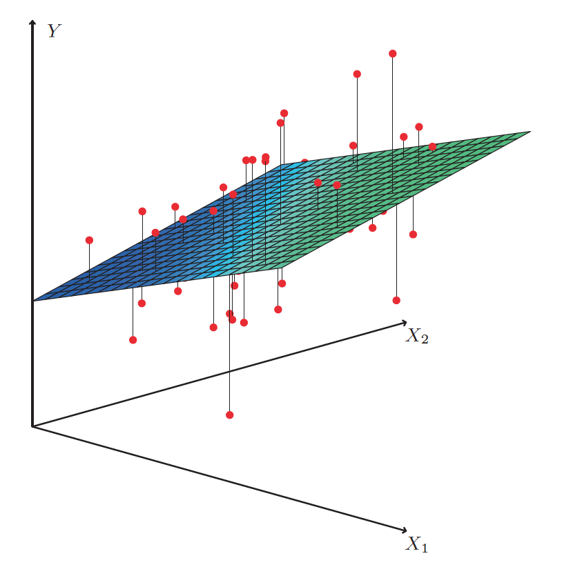

```{r setup, include=FALSE}
knitr::opts_chunk$set(echo = FALSE)

library(ggplot2)

advertising <- read.csv("Advertising.csv")
fit <- lm(Sales ~ TV + Radio + Newspaper, data=advertising)
```

## Recap

* OLS
* RSS
* Goodness of fit
    + RSE and $R^2$

## Multiple Linear Regression

* Want to consider more than one predictor
* Consider the Advertising data, we could run three separate simple linear regressions
    + Unclear how to make a single prediction of sales given levels of the three advertising media
    + Each of the three regression equations ignores the other two media

## Mulitple Regression Lines

```{r multi_r_plot, echo=FALSE, results='hide', message=FALSE}
ggplot(advertising) +
    geom_point(aes(y = Sales, x = TV), colour = "red") +
    geom_point(aes(y = Sales, x = Radio), colour = "green") +
    geom_point(aes(y = Sales, x = Newspaper), colour = "blue") +
    geom_smooth(aes(y = Sales, x = TV), method = lm, se = FALSE, colour = "red") +
    geom_smooth(aes(y = Sales, x = Radio), method = lm, se = FALSE, colour = "green") +
    geom_smooth(aes(y = Sales, x = Newspaper), method = lm, se = FALSE, colour = "blue")
```

## Multiple Linear Regression

* Extend simple linear regression
    + Each predictor given a separate slope coefficient
    + Single model

$Y = \beta_0 + \beta_1 X_1 + \beta_2 X_2 + ... + \beta_p X_p + \epsilon$

The *Advertising* data is modeled as:

$sales = \beta_0 + \beta_1 \times TV + \beta_2 \times radio + \beta_3 \times newspaper + \epsilon$

$\beta_0 = `r round(fit$coef[1], 3)`, \beta_1 = `r round(fit$coef[2], 3)`, \beta_2 = `r round(fit$coef[3], 3)`, \beta_3 = `r round(fit$coef[4], 3)`$

Interpret it as "... for a given amount of TV and newspaper advertising, spending an additional $1,000 on radio advertising leads to an increase in sales by approximately 189 units."

## Model {.smaller}

```{r echo=FALSE, message=FALSE}
summary(fit)
```

## Interpreting the Model

* Simple linear regression
    + "average effect ignoring other predictors"
* Multiple linear regression
    + "average effect while holding other predictors fixed"

## Interpretations for same predictors between models

* How can newspaper show a relationship in the simple case, but not in the multiple case?
* "Ice cream sales predict shark attacks"
    + Multiple regression of attacks vs. ice cream sales and temp, ice cream sales is no longer significant
* Useful to look at a correlation matrix

## Estimating the Regression Coefficients

* Regression coefficients $\beta_0, \beta_1, ..., \beta_p$ are unknown and must be estimated
* Given estimates $\hat{\beta_0}, \hat{\beta_1},..., \hat{\beta_p}$, we can make predictions using

$\hat{y} = \hat{\beta_0} + \hat{\beta_1}x_1 + \hat{\beta_2}x_2 + ... + \hat{\beta_p}x_p$

## Least Squares for Multiple Predictors

As we did for simple linear regression, we use the least squares method and minimize the RSS:

$\begin{align}
RSS &= \sum_{i = 1}^{n}(y_i - \hat{y_i})^2 \\
&= \sum_{i = 1}^{n}(y_i - \hat{\beta_0} - \hat{\beta_1}x_{i1} - \hat{\beta_2}x_{i2} - ... -\hat{\beta_p}x_{ip})^2
\end{align}$

Minimizing RSS is done by solving the linear system:

$\hat{\beta} = (\mathbf{X}^T\mathbf{X})^{-1}\mathbf{X}^T\mathbf{y}$

## Geometric Representation

```{r, out.width = 400, fig.retina = NULL}

```

Two predictors is a plane

## Is There a Relationship Between Response and Predictors?

* Use a hypothesis test

$H_0 : \beta_1 = \beta_2 = ... = \beta_p = 0$

$H_a$ : at least one $\beta_j$ is non-zero

## F-statistic

* Hypothesis test is performed by computing the *F-statistic*
    + Follows an F-distribution
    + For any given values of *n* and *p* a p-value can be computed
    + Can determine whether or not to reject $H_0$
* t-statistic and p-value for each predictor
    + Reports the *partial effect* of adding that variable to the model
* Don't ignore the F-statistic for the p-values when p is large
    + For instance, if $p = 100$ and $H_0$ is true, about 5% of p-values will be below 0.05 by chance!
    + If $p$ is large, we can use what we discuss next

## Deciding on Important Variables

* If we decide that at least one predictor is related to the response, we want to know which ones
* Determining which predictors are associated with response is known as *variable selection*
    + Covered more in Chapter 6
* Ideally, we'd like to try a bunch of different models
    + Different statistics can be used to judge model quality
* For $p$ predictors, there are $2^p$ models!

## Model Selection

* Forward selection
    + Start with null model and add in predictors that result in lowest RSS
    + Can always be used
* Backward selection
    + Start with all variables and remove based on non-significant p-values
    + Can't be used if $p > n$
* Mixed selection
    + Start with forward selection, remove any p-values that are non-significant

## Adjusted $R^2$

## Model Fit

## Predictions

* Uncertainties in Predictions
    + Coefficient estimates
    + Model bias
    + Random error, $\epsilon$, in the model -- irreducible error

## Tools to Understand Uncertainty

* Confidence intervals for coefficient estimates
    + Inaccuracy is related to the *reducible error*
    + Quantify the uncertainty surrounding the *average* sales over a large number of cities
* Prediction intervals for predictions
    + Always wider than confidence intervals
    + Incorporate reducible and irreducible error
    + Quantify the uncertainty surrounding sales for a *particular* city


