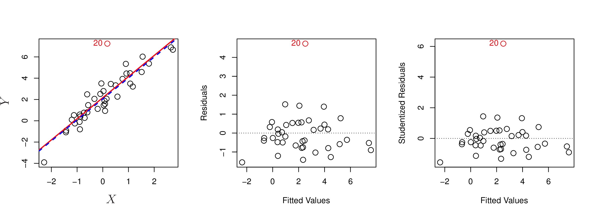

```{r setup, include=FALSE}
library(knitr)
library(scales)
library(broom)
library(ISLR)

knitr::opts_chunk$set(echo = FALSE)

credit <- read.csv("Credit.csv")
```

## Recap

* Estimating coefficients using least squares for multiple predictors
* Model interpretation
* Model selection and statistics for goodness of fit
* Uncertainties surrounding models

## Recap -- Interpreting coefficients in MLR

$sales = \beta_0 + \beta_1 \times TV + \beta_2 \times radio + \beta_3 \times newspaper + \epsilon$

* Coefficients $\beta_1, \beta_2, \beta_3$ are the "average increase in the response to a one-unit increase in the predictor holding all other predictors fixed"
* Additive assumption in the linear model
    + More on this today!

## Qualitative Predictors

* Thus far our variables have been *quantitative*
* But often some predictors are *qualitative*
    + Gender (male, female)
    + Ethnicity (African American, Asian, Caucasian)
* The response variable is still *quantitative*
    + This is regression, not classification
* Example: the **Credit** data set

## Qualitative Predictors with Only Two Levels

* Create a *dummy variable* that can take on two possible vaues

$x_i=
\begin{cases}
1 & \text{if } i\text{th person is female}\\
0 & \text{if } i\text{th person is male}\\
\end{cases}$

$y_i = \beta_0 + \beta_1x_i + \epsilon_i = 
\begin{cases}
\beta_0 + \beta_1 + \epsilon_i & \text{if } i\text{th person is female}\\
\beta_0 + \epsilon_i & \text{if } i\text{th person is male}\\
\end{cases}$

* $\beta_0$ is the average credit card balance among males
* $\beta_0 + \beta_1$ is the average credit card balance among females
* $\beta_1$ is the average difference in credit card balance between females and males

## Interpretation of the Balance ~ Gender Model {.smaller}

```{r gender}
fit <- lm(Balance ~ Gender, data = credit)
kable(summary(fit)$coeff, digits = 2)
```

* Average credit card debt for males is $509.80
* Females are estimated to carry an additional $19.73 in credit card debt
* What can we say about the p-value for the female variable?

## Choosing the values for dummy variables

* The chosen values are arbitrary and have no effect on the regression fit
* Does alter the interpretation of the coefficients
* See the book for further examples

## Qualitative Predictors with More than Two Levels {.smaller}

* A single dummy varible is not sufficient, so we create more dummy variables

$x_{i1}=
\begin{cases}
1 & \text{if } i\text{th person is Asian}\\
0 & \text{if } i\text{th person is not Asian}\\
\end{cases}$

$x_{i2}=
\begin{cases}
1 & \text{if } i\text{th person is Caucasian}\\
0 & \text{if } i\text{th person is not Caucasian}\\
\end{cases}$

$y_i = \beta_0 + \beta_1x_{i1} + \beta_2x_{i2} + \epsilon_i = 
\begin{cases}
\beta_0 + \beta_1 + \epsilon_i & \text{if } i\text{th person is Asian}\\
\beta_0 + \beta_2 + \epsilon_i & \text{if } i\text{th person is Caucasian}\\
\beta_0 + \epsilon_i & \text{if } i\text{th person is African American}\\
\end{cases}$

* $\beta_0$ is the average credit card balance for African Americans
* $\beta_1$ is the difference in average credit card balance between Asians and African Americans
* $\beta_2$ is the difference in average credit card balance between Caucasians and African Americans


## Interpretation of the Balance ~ Ethnicity Model {.smaller}

```{r ethnicity}
fit <- lm(Balance ~ Ethnicity, data = credit)
kable(summary(fit)$coeff, digits = 2)
```

* There will always be one fewer dummy variable than number of levels
* The level with no dummy variable - African Americans in this example - is known as the *baseline*
* The average balance for African Americans, the baseline, is $531.00
* The average balance for Asians is $18.69 less than for African Americans
* The average balance for Caucasians is $12.50 less than for African Americans
* Again, what can we say about the p-values for the dummy variables?

## Extensions of the Linear Model

* The linear model is interpretable and works well on many real-world problems
* However, there are several highly restrictive assumptions that are violated in practice
* Two of the most important assumptions state that the relationship between predictors and response are *additive* and *linear*
    + Additive means that the changes in predictor $X_j$ on the response $Y$ is independent of the values of other predictors
    + Linear states that the change in the response $Y$ due to a one-unit change in $X_j$ is constant regardless of $X_j$

## Removing the Additive Assumption

* In the sales example, we state that the average effect on **sales** of a one-unit increase in **TV** is always $\beta_1$ regardless of the amount spent on **radio**
* What if spending money on **radio** actually increases **TV** advertising?
    + This is called a *synergy* or *interaction* effect
    + Modeling this can be done by including a new predictor called an *interaction* term

## Adding an interaction term

$\begin{align}
Y &= \beta_0 + \beta_1X_1 + \beta_2X_2 + \beta_3X_1X_2 + \epsilon \\
&= \beta_0 + (\beta_1 + \beta_3X_2)X_1 + \beta_2X_2 + \epsilon \\
&= \beta_0 + \hat{\beta_1}X_1 + \beta_2X_2 + \epsilon
\end{align}$

* Since $\hat{\beta_1}$ changes with $X_2$, the effect of $X_1$ on $Y$ is no longer constant
    + Adjusting $X_2$ will change the impact of $X_1$ on $Y$
* Consider the factory example, can't increase units by just adding another production line, you also need workers to operate the lines!

## Sales data with interaction term

$\begin{align}
sales &= \beta_0 + \beta_1 \times TV + \beta_2 \times Radio + \beta_3 \times (Radio \times TV) + \epsilon \\
&= \beta_0 + (\beta_1 + \beta_3 \times Radio) \times TV + \beta_2 \times Radio + \epsilon
\end{align}$

* We interpret $\beta_3$ as the increase in the effectiveness of **TV** advertising for a one unit increase in **Radio** advertising (or vice-versa)

## Sales model with interaction term {.smaller}

```{r echo=TRUE}
advertising <- read.csv("Advertising.csv")
fit1 <- lm(Sales ~ TV + Radio, data = advertising)
fit2 <- lm(Sales ~ TV + Radio + TV*Radio, data = advertising)
```

```{r}
kable(summary(fit2)$coeff, digits = 4)
```

* We add an interaction term between **Radio** and **TV**
* The adjusted $R^2$ improves **signficantly**
    + With no interaction term, the adjusted $R^2$ is ```r percent(summary(fit1)$adj.r.squared)```
    + With an interaction term, the adjusted $R^2$ is ```r percent(summary(fit2)$adj.r.squared)```

## Terminology for interaction terms

* The *main effects* are the predictors that are not interaction terms
    + TV, Radio are the *main effects* in the previous model
* The *interaction effects* are predictors that are derived from *main effects*
    + TV$\times$Radio in the model is an *interaction effect*
* If you include an interaction term, you should also include the main effects that make up the interaction, even if the p-values associated with the main effects are not significant
    + Book calls this the *hierarchical principle*

## Interaction terms for qualitative predictors {.smaller}

* Consider the **Credit** data set, we want to predict **balance** using **income** (quantitative) and **student** (qualitative) variables.  With no interaction term, the model takes the form

$\begin{align}
balance_i &\approx \beta_0 + \beta_1 \times income_i + 
\begin{cases}
\beta_2 &\text{if }i\text{th person is a student} \\
0 &\text{if }i\text{th person is not a student}
\end{cases} \\
&= \beta_1 \times income_i +
\begin{cases}
\beta_0 + \beta_2 &\text{if }i\text{th person is a student} \\
\beta_0 &\text{if }i\text{th person is not a student}
\end{cases}
\end{align}$

* With an interaction term, the model takes the form

$\begin{align}
balance_i &\approx \beta_0 + \beta_1 \times income_i + 
\begin{cases}
\beta_2 + \beta_3 \times income_i &\text{if student} \\
0 &\text{if not student}
\end{cases} \\
&=
\begin{cases}
(\beta_0 + \beta_2) + (\beta_1 + \beta_3) \times income_i &\text{if student} \\
\beta_0 + \beta_1 \times income_i &\text{if not student}
\end{cases}
\end{align}$

## Interaction terms for qualitative predictors (visualization)

```{r, out.width = 800, fig.retina = NULL}

```


## Non-linear Relationships

* Linear regression model assumes a linear relationship between response and predictors
* But the true relationship may be non-linear
* Polynomial regression - a simple way to extend the linear model to accommodate non-linear relationships

## **Auto** data set {.smaller}

```{r, out.width = 400, fig.retina = NULL}
knitr::include_graphics("images/3.8.png")
```

* There is a pronounced relationship between **mpg** and **horsepower**, but it seems clear the relationship is non-linear
* A simple approach is to include transformed versions of the predictors in the model
    + It appears that the points have a *quadratic* shape

## Quadratic model

* The previous plot suggests a model of the form

$mpg = \beta_0 + \beta_1 \times horsepower + \beta_2 \times horsepower^2$

* The model involved predicting **mpg** using a non-linear function of **horsepower**
    + *But it is still a linear model!*
    + It is simply a multiple linear regression model with $X_1 = horsepower$ and $X_2 = horsepower^2$

## Model analysis {.smaller}

```{r echo=TRUE}
fit1 <- lm(mpg ~ horsepower, data = Auto)
fit2 <- lm(mpg ~ horsepower + I(horsepower^2), data = Auto)
```

```{r}
kable(summary(fit2)$coeff, digits = 4)
```

* The $R^2$ of the quadratic fit is ```r percent(summary(fit2)$adj.r.squared)``` compared to ```r percent(summary(fit1)$adj.r.squared)``` for the linear fit
* The p-value for the quadratic term is highly significant
* Adding a quadratic term worked so well, why not include $horsepower^3$, $horsepower^4$ or even $horsepower^5$?
    + The green curve includes all polynomials up to the 5th degree
    + Looks a bit *wiggly*

## Potential Problems

* Most common problems that may appear:
    + Non-linearity of the response-predictor relationships
    + Correlation of error terms
    + Non-constant variance of error terms
    + Outliers
    + High-leverage points
    + Collinearity
* Overcoming these problems is as much an art as a science!

## Non-linearity of the Data {.smaller}

```{r, out.width = 400, fig.retina = NULL}

```

* *Residual plot*
    + Help ascertain if the linear relationship holds
    + Plot residuals vs. fitted values
    + Should see no discernable pattern
* If the residual plot indicates there are non-linear associations, then a simple approach is to use non-linear transformations of the predictors, such as $log X$, $\sqrt{X}$, and $X^2$


## Correlation of Error Terms

* Assumption of the linear model is that the error terms are uncorrelated
    + The fact that $\epsilon_i$ is positive provides little or no information about the sign of $\epsilon_{i+1}$
* If the error terms *are* correlated, then the estimated standard errors will tend to underestimate the true standard errors
    + Confidence and prediction intervals will be narrower than they should be
    + p-values associated with the model will be lower than they should be
* If error terms are correlated we may have an unwarranted sense of confidence in our model

## Time Series data {.smaller}

```{r, out.width = 300, fig.retina = NULL}

```

* Correlated error terms frequently occur in the context of *time series* data
* Observations that are obtained at adjacent time points will
have positively correlated errors
* We can plot the residuals as a function of time to determine this
    + If the errors are uncorrelated, then there should be no discernable patterns
    + If the errors are positively correlated, *tracking* can occur

## Non-constant Variance of Error Terms {.smaller}

```{r, out.width = 300, fig.retina = NULL}

```

* Linear models assume constant variance in error terms, i.e.:

$Var(\epsilon_i) = \sigma^2$

* Often this is not the case
* Variance may increase with the value of the response
    + Heteroscedasticity, indicated by a funnel shape in the residual plot
* Can correct for this problem by transforming the response using a concave function such as $log Y$ or $\sqrt{Y}$
* *Weighted least squares* is an option in some cases

## Outliers {.smaller}

```{r, out.width = 600, fig.retina = NULL}

```

* An *outlier* occurs when $y_i$ is far from the value predicted
    + Can happen for a variety of reasons, such as incorrect data input
* Note that the outlier in this example doesn't have much effect on the regression line
* But it can have a dramatic effect on RSE, which can effect confidence intervals and p-values
* Residual plots can be used to identify outliers
    + *Studentized* residuals can be used as an objective gauge on outliers
* Must be careful in how you handle outliers

## High Leverage Points {.smaller}

```{r, out.width = 600, fig.retina = NULL}

```

* Outliers are observations for which the response is unusual given the predictor
* Observations with *high leverage* have an unusual value for the predictor
    + They tend to have a sizable effect on the estimated regression line
* Use the *leverage statistic* to quantify an observation's leverage
    + Especially useful in multiple linear regression
* Note that observation 40 has high leverage and is an outlier, a deadly combination!

## Collinearity {.smaller}

```{r, out.width = 400, fig.retina = NULL}

```

* If two predictors are highly correlated, we say the are *collinear*
* It can be hard to determine how each collinear variable is associated with the response

## Quantifying collinearity {.smaller}

```{r, out.width = 400, fig.retina = NULL}

```

* Collinearity reduces the accuracy of the estimates of the regression coefficients
* Compare the left and right panels above, in the right, minimizing the RSS has some uncertainty
* Simple way to detect collinearity is a corrleation matrix of predictors
    + Multicollinearity can not be detected this way!
* *Variance inflation factor* (VIF) can be used
    + Smallest value is 1, a VIF that exceeds 5 or 10 indicates a problematic amount of collinearity

## Resolving collinearity

* Two simple solutions
    + Drop one of the problematic variables from the model
    + Combine collinear variables together into a single predictor


## The Marketing Plan

1. *Is there a relationship between advertising sales and budget?*
2. *How strong is the relationship?*
3. *Which media contribute to sales?*
4. *How large is the effect of each medium on sales?*
5. *How accurately can we predict future sales?*
6. *Is the relationship linear?*
7. *Is there synergy among the advertising media?*

## Is there a relationship between advertising sales and budget?

We used the F-statistic to derive p-values which were low indicating that there is a significant relationship between advertising and sales.

## How strong is the relationship?

We used the RSE and the $R^2$ statistic to quantify the fit of the model.  The $R^2$ in particular explained almost 90% of the variance in sales.

## Which media contribute to sales?

Using the p-values for each predictor we found that TV and radio were signficant while newspaper was not.  So we conclude that TV and radtion are related to sales.

## How large is the effect of each medium on sales?

We found the confidence intervales for each medium and while TV and radio were narrow and didn't include 0, the confidence interval for newspaper did include 0 indicating that newspaper is not statistically significant given TV and radio.

We check for collinearity to see if that can explain why the confidence intervales for newspaper are so wide, but find that the VIF scores are near 1, indicating that collinearity is not a problem.

Separate simple linear regressions indicate strong association between TV and sales and radio and sales, but only a mild association with newspapre and sales.

## How accurately can we predict future sales?

The accuracy depends on whether we want to an individual response or the average response.  If the former, then we use a prediction interval, and if the latter, we use a confidence interval.

## Is the relationship linear?

For the **Advertising** data we observed a non-linear effect in the plot of the data itself, but a residual plot would also show the non-linear effect.  We discussed the inclusion of transformations of predictors  in order to accommodate non-linear relationships.

## Is there synergy among the advertising media?

We included an interaction term in the regression model and found a small p-value associated with the interaction term indicating that there is a significant effect.  By adding the interaction term, our $R^2$ substantially increased from about 90% to almost 97%.
