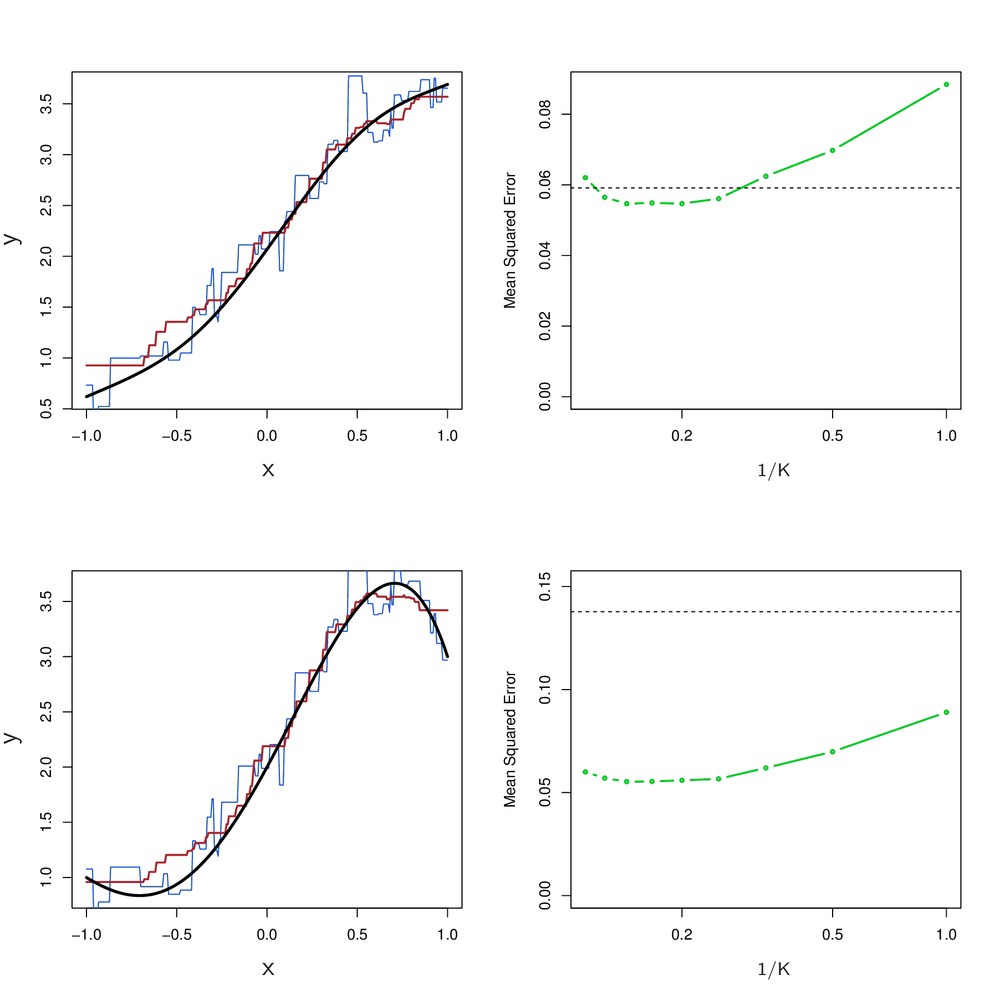

```{r setup, include=FALSE}
knitr::opts_chunk$set(echo = FALSE)
```

## Parametric vs non-parametric

* Linear regression is an example of a *parametric* approach
    + Advantage, easy to fit because you only need to estimate a small number of coefficients
    + Disadvantage, make strong assumptions about the form of $f(X)$
* *Non-parametric* methods do not assume a parametric form for $f(X)$, provide a more flexible approach for regression
* Here we use K-nearest neighbors regression as an example

## Introduction to K-Nearest Neighbors

* Find the K nearest neighbors
    + Nearest based on some concept of "distance", e.g. euclidian distance
* Vote based on the variable being used to classify
* Generally thought of as a classification algorithm, but can be used in regression
    + Instead of voting using the classification variable, average the response variable of the K neighbors
* A type of *lazy learning*
    + All computation deferred until classification
* Among the simplest of all machine learning algorithms

## K-Nearest Neighbors Implementation

* Given a value for $K$ and a prediction point $x_0$, identify the $K$ training observations that are closest to $x_0$ represented by $\mathcal{N}_0$
* It then estimates $f(x_0)$ using the average of all training responses in $\mathcal{N}_0$

$\hat{f}(x_0) = \frac{1}{K}\sum\limits_{x_i \in \mathcal{N}_0} y_i$

## The Effect of K in KNN

```{r, out.width = 400, fig.retina = NULL, fig.align='center'}

```

* K = 1 is a rough step function
* K = 9 is a smoother fit
* Optimal value for K depends on the bias-variance tradeoff

## Bias-Variance Tradeoff

* Bias
    + Error from erroneous assumptions in the learning algorithm
    + High bias can cause an algorithm to miss relevant relations between features and target outputs (underfitting)
* Variance
    + Error from sensitivity to small fluctuations in the training set
    + High variance can cause overfitting: modeling the random noise in the training data, rather than the intended outputs

## Bias-Variance in KNN

* A small value for K provides the most flexible fit, which will have low bias but high variance
* Larger values for K provide a smoother, but less variable fit
    + But may cause some bias by masking some of the structure in $f(X)$
* Chapter 5 introduces approaches for estimating error rates which can be used to find the optimal value for K

## When will parametric approach outperform a non-parametric approach?

```{r, out.width = 400, fig.retina = NULL, fig.align='center'}

```

* When the parametric form is close to the true form of *f*
* Non-parametric approach incurs a cost in variance that is not offset by a reduction in bias

## When $f(X)$ is linear

```{r, out.width = 400, fig.retina = NULL, fig.align='center'}

```

* The linear fit is almost perfect
* The MSE for KNN is well above the linear regression MSE

## When $f(X)$ is non-linear

<div class="columns-2">
  

  * True relationship between $X$ and $Y$ is rarely exactly linear
  * KNN is competitive when relationship is somewhat linear and much better when non-linear
    + Note MSE increase for linear regression vs. KNN
  * So why not use KNN always?
</div>

## Comparison in Higher Dimensions

```{r, out.width = 800, fig.retina = NULL, fig.align='center'}

```

* For $p = 1$ or $p = 2$, KNN outperforms linear regression
* For $p = 3$, results are mixed
* For $p \geq 4$, linear regression is superior

## The Curse of Dimensionality

* For KNN, higher dimensions effectively reduces sample size
    + Spreading 100 observations over $p = 20$ dimensions results in an observation that has no nearby neighbors
    + The Curse of Dimensionality
* As a general rule, parametric methods will tend to outperform non-parametric methods when there is a small number of observations per predictor

## Interpretability is still Important!

* Even with small dimensions we might prefer linear regression to KNN for interpretability
* If the test MSE of KNN is only slightly lower than that of linear regression, we might forego a little bit of prediction accuracy for the sake of a simple model that can be described in terms of just a few coefficients, and for
which p-values are available.

## Linear Regression Review {.smaller}

* Linear Regression
    + Interpreting the model
    + Deciding on important variables
    + Goodness of fit (RSE, $R^2$)
* Other considerations
    + Qualitative predictors
    + Extensions of the linear model
    + Diagnostics for linear models
* Fundamental concepts
    + Bias-Variance Tradeoff
    + Parametric vs Non-parametric
    + Curse of dimensionality
