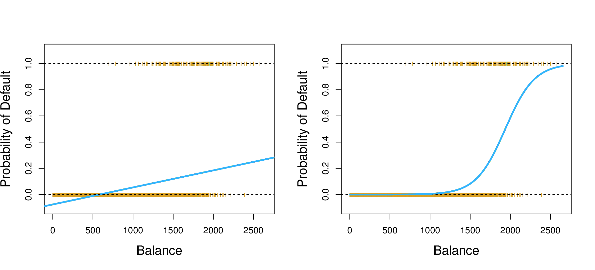
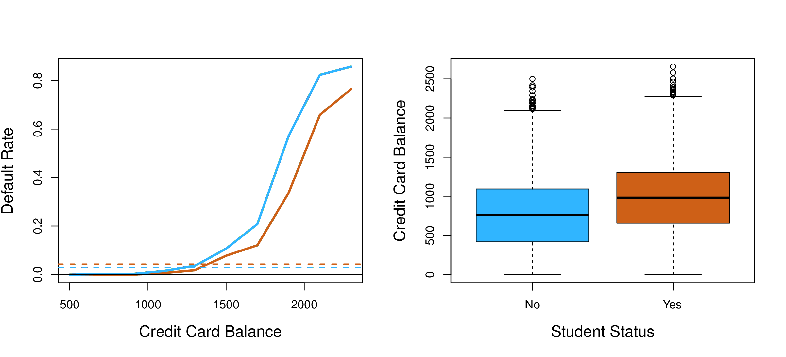

```{r setup, include=FALSE}
library(knitr)
library(ISLR)

knitr::opts_chunk$set(echo = FALSE)
```

## Classification

* Response variable is *qualitative*
    + Eye color (blue, green, brown)
    + Sex (Male, Female)
* Predicting qualitative responses is known as *classification*
    + Predicting qualitative response for an observation referred to as *classifying* that observation
* Often the methods used for classification predict a *probability*
    + In this sense they behave like regression methods

## Classifiers

* Many possible classification techniques, or *classifiers*
* In this chapter (chapter 4)
    + Logistic regression
    + Linear discriminant analysis
    + K-nearest neighbors
* Future chapters
    + Generalized additive models (chapter 7)
    + Trees, random forests, and boosting (chapter 8)
    + Support vector machines (chapter 9)

## An Overview of Classification

* "Classification problems occur often, perhaps even more so than regression problems."
* Examples
    + Which of three conditions does a person arriving at an emergency room have?
    + Determine if a banking transaction is fraudulent
    + Which DNA mutations are disease causing and which are not?

## Why not Linear Regression?

* In general there is no natural way to convert a qualitative response variable with more than two levels into a quantitative response that is ready for linear regression
* For a binary qualitative response, the situation is better
    + We could potentially use the *dummy variable* approach from the last chapter
    
$Y=
\begin{cases}
0 & \text{if } stroke\\
1 & \text{if } drug overdose\\
\end{cases}$

## Linear Regression for a Binary Response {.smaller}

```{r, out.width = 600, fig.retina = NULL, fig.align='center'}

```

* For a binary response with the 0/1 encoding, least squares does make sense
* However, some of our estimates might be outside the [0, 1] interval
* Cannot be extended to accommodate qualitative responses with more than two levels

## Logistic Regression

* Models the *probability* that the response $Y$ belongs to a particular category
* $Pr(default = Yes|balance)$, abbreviate to $p(balance)$, ranges between 0 and 1
* Choose a threshold
    + $default = Yes$ for any individual for whom $p(balance) > 0.5$
    + Alternativley, a more conservative threshold could be chosen, such as $p(balance) > 0.1$

## The Logistic Model

* How should we model the relationship between $p(X) = Pr(Y = 1|X)$ and $X$?
* $p(X) = \beta_0 + \beta_1X$
    + See figure 4.2
    + For probabilities close to 0, we predict a negative probability of default
    + For very large balances, we get values bigger than 1

## Logistic Function

$p(X) = \frac{e^{\beta_0 + \beta_1X}}{1 + e^{\beta_0 + \beta_1X}}$

* To fit the model we use *maxium likelihood*
* We now predict low balances as close to, but never below, zero
* High balances are predicted as close to, but never above, one
* Produces an S-shaped curve
* Better captures the range of probabilities than the linear model
* The *sigmoid* function is a special case of the logistic function

## Odds and Log Odds

$\frac{p(X)}{1 - p(X)} = e^{\beta_0 + \beta_1X}$
 
* The *odds*, used in horse-racing
* 1 in 5 people with an odds of 1/4 will default
    + $\frac{0.2}{1 - 0.2} = 1/4$
* By taking the logarithm of both sides we get:

$log(\frac{p(X)}{1 - p(X)}) = \beta_0 + \beta_1X$

* Left-hand side is call the *log-odds* or the *logit*
* Shows that logistic regression model has a logit that is linear in $X$

## Interpreting the coefficients {.smaller}

* Recall that for the linear model, $\beta_1$ gives the average change in $Y$ associated with a one-unit increase in $X$
* In contrast, in a logistic regression model, increasing $X$ by one unit changes the *log odds* by $\beta_1$
    + Equivalently, it multiplies the odds by $e^\beta_1$
* Because the the relationship between $p(X)$ and $X$ is not linear, $\beta_1$ does *not* correspond to the change in $p(X)$
    + The amount that $p(X)$ changes due to a one-unit change in $X$ depends on the current value of $X$
    + However, if $\beta_1$ is positive, then increasing $X$ will be associated with increasing $p(X)$
    + Similarly, if $\beta_1$ is negative, then increasing $X$ will be associated with decreasing $p(X)$
    + See figure 4.2

## Estimating the coefficients

* Maximum likelihood

$L(\beta_0, \beta_1) = \prod\limits_{i:y_i=1}p(x_i) \prod\limits_{i':y_{i'}=0}(1 - p(x_{i'}))$

* The estimates $\hat\beta_0$ and $\hat\beta_1$ are chosen to *maximize* this likelihood function
* Least squares is a special case of maximum likelihood

## Interpretations of Logistic Regression Model {.smaller}

```{r}
fit <- glm(default ~ balance, data = Default, family = "binomial")
kable(summary(fit)$coeff, digits = 4)
```


* Output similar to the linear regression output
* z-statistic plays same role as the t-statistic
    + Large absolute value for the z-statistic indicates evidence against the null hypothesis
* $H_0$ can be rejected because the p-value associated with *balance* is very small

## Making predictions

$\begin{align}
\hat{p}(X) &= \frac{e^{\hat{\beta_0} + \hat{\beta_1}X}}{1 + e^{\hat{\beta_0} + \hat{\beta_1}X}} \\
&= \frac{e^{−10.6513+0.0055×1,000}}{1 + e^{−10.6513+0.0055×1,000}} \\
&= 0.00576
\end{align}$

* Default probability for an individual with a balance of $1,000
    + Below 1%
* In contrast, the predicted probability of default for an individual with a balance of $2,000 is much higher, 58.6%

## Example single quantitative predictor

```{r echo=TRUE}
fit <- glm(default ~ balance, data = Default, family = "binomial")
```

```{r}
kable(summary(fit)$coeff, digits = 4)
```

## Qualitative predictors {.smaller}

* For qualitative predictors, we use the dummy variable approach as we did for linear regression
* For the **Default** data we can create a dummy variable with value 1 for students and 0 for non-students

$\begin{align}
\hat{Pr}(default=Yes|student=Yes) &= \frac{e^{−3.5041+0.4049×1}}{1 + e^{−3.5041+0.4049×1}} = 0.0431 \\
\hat{Pr}(default=Yes|student=No) &= \frac{e^{−3.5041+0.4049×0}}{1 + e^{−3.5041+0.4049×0}} = 0.0292
\end{align}$

* p-value indicates that **student** is statistically significant
* Students tend to have higher default probabilities than non-students

## Example for qualitative predictors

```{r echo=TRUE}
fit <- glm(default ~ student, data = Default, family = "binomial")
```

```{r}
kable(summary(fit)$coeff, digits = 4)
```

## Multiple Logistic Regression

* Extend the logit function to multiple predictors:

$log(\frac{p(X)}{1 - p(X)}) = \beta_0 + \beta_1X_1 + \ldots + \beta_pX_p$

Rewrite as:

$p(X) = \frac{e^{\beta_0 + \beta_1X_1 + \ldots + \beta_pX_p}}{1 + e^{\beta_0 + \beta_1X_1 + \ldots + \beta_pX_p}}$

And use maximum likelihood to solve for $\beta_0, \beta_1, \ldots, \beta_p$

## Example for multiple predictors {.smaller}

```{r echo=TRUE}
fit <- glm(default ~ balance + income + student, data = Default, family = "binomial")
```

```{r}
kable(summary(fit)$coeff, digits = 4)
```

* Note the negative coefficent for studentYes

## Confounding {.smaller}

* For a fixed value of **balance** and **income** a student is less likely to default than a non-student
    + In figure 4.3 the student default rate is at or below that for non-students
    + Horizontal broken lines show default rates averaged over all values for **balance** and **income**
* It turns out, **student** and **balance** are correlated
    + Students tend to hold higher levels of debt which is associated with higher levels of default
    + "Thus, even though an individual student with a given credit card balance will tend to have a lower probability of default than a non-student with the same credit card balance, the fact that students on the whole tend to have higher credit card balances means that overall, students tend to default at a higher rate than
non-students"
* This phenomena is known as *confounding*

## Making predictions

```{r, out.width = 400, fig.retina = NULL, fig.align='center'}

```

* A student with a credit card balance of $1,500 and an income of $40,000 has an estimated probability of default of

$\hat{p}(X) = \frac{e^{−10.869+0.00574×1,500+0.003×40−0.6468×1}}{1 + e^{−10.869+0.00574×1,500+0.003×40−0.6468×1}} = 0.058$

* A non student with the same balance and income has an estimated probability of default of:

$\hat{p}(X) = \frac{e^{−10.869+0.00574×1,500+0.003×40−0.6468×0}}{1 + e^{−10.869+0.00574×1,500+0.003×40−0.6468×0}} = 0.105$

## Logistic Regression for >2 Response Classes

$Pr(Y = k|X) = \frac{e^{\beta_{0k} + \beta_{1k}X_1 + \ldots + \beta_{pk}X_p}}{\sum_{\ell = 1}^{K}e^{\beta_{0\ell} + \beta_{1\ell}X_1 + \ldots + \beta_{p\ell}X_p}}$

* There is a linear function for *each* class
* Known as the *softmax* function


