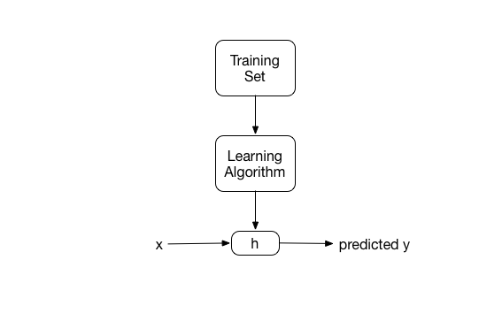

```{r setup, include=FALSE}

library(ggplot2)

knitr::opts_chunk$set(echo = FALSE)
```

## Motivation

* Learn what goes on "under the covers"
    + You never know when a Q & D ML algorithm might be useful!
* Prepare for more advanced topics
    + Neural networks
* Learn a different perspective
    + Andrew Ng is one of the preeminent researchers and teachers of ML
* For fun!

## Supervised Learning

* Input **features** denoted by $x^{(i)}$
    + We've been calling these **predictors**
* **Target** variable is denoted by $y^{(i)}$
    + We've been calling this the **response**
* A pair ($x^{(i)}$, $y^{(i)}$) is called a **training example**
* List of $m$ training examples $\{(x^{(i)}, y^{(i)}); i = 1, ..., m\}$ is called a **training set**
* $\mathcal{X}$ denotes the space of input values
* $\mathcal{Y}$ denotes the space of output values
* $\mathcal{X} = \mathcal{Y} = \mathbb{R}$

## Defining Supervised Learning {.smaller}

* Given a training set, learn a function $h : \mathcal{X} \mapsto \mathcal{Y}$ so that $h(x)$ is a "good" predictor for the corresponding value of $y$
* The function $h$ is called a **hypothesis**

```{r, out.width = 400, fig.retina = NULL, fig.align='center'}

```

* When the target variable is continuous, the learning problem is called **regression**
* When the target variable is discrete, we call it a **classification** problem

## Linear Regression Review

* Our linear model:

$h_\theta(x) = \theta_0 + \theta_1 x_1 + \theta_2 x_2$

* $\theta_i$'s are the **parameters** or **weights**
* We'll introduce $x_0 = 1$ as an **intercept** term, then:

$h(x) = \sum_{i = 0}^{n} \theta_i x_i = \theta^Tx$

## Linear Regression -- Fitting the Parameters

* How do we fit $theta$ for our data?
* Make $h(x)$ close to $y$ for our data, so define a **cost** function

$J(\theta)  = \frac{1}{2} \sum_{i = 1}^{m} (h_\theta (x^{(i)}) - y^{(i)})^2$

* This is our familiar **ordinary least squares**
* Measures the squared error from our predicted value, parameterized by $\theta$, and the actual value for each training observation

## Gradient Descent {.smaller}

* We want to choose $\theta$ to minimize $J(\theta)$
* Use a search algorithm with an "initial guess" for $\theta$ and that repeatedly changes $\theta$ to make $J(\theta)$ smaller, hopefully converging to a $\theta$ that minimizes $J(\theta)$
* Specifically, we'll consider **gradient descent**, which starts with an initial $\theta$ and repeatedly performs the update rule:

$\theta_j := \theta_j - \alpha \frac{\partial}{\partial \theta_j} J(\theta)$

* $\alpha$ is the **learning rate**
* For linear regression, this update rule is:

repeat until convergence {

$\theta_j := \theta_j + \alpha \sum_{i = 1}^{m} (y^{(i)} - h_\theta(x^{(i)})) x_j^{(i)}$ (for every j)

}

* This is **batch gradient descent**

## Other ways to fit $\theta$

$\theta = (X^TX)^{-1}X^Ty$

* The normal equations
    + Very common way to solve linear regression using linear algebra
    + Works well for relatively large datasets (< 10000 features)
    
$L(\theta) = \prod_{i = 1}^m \frac{1}{\sqrt{2\pi\sigma}} \text{exp}(-\frac{(y^{(i)} - \theta^T x^{(i)})^2}{2 \sigma^2})$
    
* Maximum Likelihood
    + choose $\theta$ so as to make the data as high probability as possible.
    + In other words, choose $\theta$ to maximize $L(\theta)$

## Logistic Regression

* Used to predict binary outcomes
* We use the sigmoid or logistic function as our hypothesis
    + Gives us a probability for inputs
    
$h_\theta(x) = g(\theta^Tx) = \frac{1}{1 + e^{-\theta^Tx}}$

```{r sigmoid, out.height=300, out.width=400 }
qplot(-10:10, 1/(1 + exp(-(-10:10))), geom="line", xlab="z", ylab="sigmoid function")
```

## Logistic Regression -- Fitting the parameters

* There is no analytical solution, so we use maximum likelihood
* Since we have a binary outcome, we can use the bernoulli distribution

$p(y \mid x;\theta) = (h_\theta(x))^y (1 - h_\theta(x))^{1 - y})$

* Taking the joint distribution of the observations, we get the likelihood function

$\prod_{i = 1}^m (h_\theta(x^{(i)}))^{y^{(i)}} (1 - h_\theta(x^{(i)}))^{1-y^{(i)}}$

## Maximum Likelihood - Simplifying {.smaller}

* In order to maximize our likelihood function, we need to take the derivative of it and set it equal to 0
* Taking a derivative of a bunch of products is complicated and results in numerical instability in the calculation
* Because the $log$ function is a monotonic strictly increasing function, we recognize that maximizing the *log* likelihood is precisely equivalent to maximizing the likelihood, and also to minimizing the *negative* log likelihood.

$\begin{align}
\ell(\theta) &= logL(\theta) \\
&= \sum_{i=1}^m y^{(i)} log h(x^{(i)}) + (1 - y^{(i)}) log(1 - h(x^{(i)}))
\end{align}$

* This is our cost function, $J(\theta)$

## Gradient Descent {.smaller}

* In order to maximize our cost function, we need it's derivative with respect to $\theta$
* It's important to note that in MLE, we treat the data as constants, it's the parameter $\theta$ that varies
    + So we take the partial derivative of the cost function with respect to $\theta$

$\frac{\partial}{\partial \theta_j} \ell(\theta) = (y - h_\theta(x)) x_j$

* This forms the basis of our update function.  For batch gradient descent, we have the update rule

repeat until convergence {

$\theta_j := \theta_j + \alpha \sum_{i = 1}^{m} (y^{(i)} - h_\theta(x^{(i)})) x_j^{(i)}$ (for every j)

}

* This *looks* identical to the update rule for linear regression
    + But $h_\theta(x^{(i)})$ is now non-linear
    
## So where are we?

* We have our hypothesis function $h_\theta(x^{(i)})$, the sigmoid function

* We have our cost function $J(\theta)$

* And we have our gradient + update function

## Hypothesis function

```python
def sigmoid(z):
    return 1 / (1 + np.exp(-z))
```

$h_\theta(x) = g(\theta^Tx) = \frac{1}{1 + e^{-\theta^Tx}}$

## Cost function

```python
def cost(Y, X, theta):
    p = sigmoid(X.dot(theta))
    loglikelihood = Y * np.log(p + 1e-24) + (1 - Y) * np.log(1 - p + 1e-24)
    return -1 * loglikelihood.sum()
```

$\begin{align}
\ell(\theta) &= logL(\theta) \\
&= \sum_{i=1}^m y^{(i)} log h(x^{(i)}) + (1 - y^{(i)}) log(1 - h(x^{(i)}))
\end{align}$

## Gradient and Update Rule

```python
def gradient(Y, X, theta):
    return ((Y - sigmoid(X.dot(theta))) * X).sum(axis = 0).reshape(theta.shape)
```

$\sum_{i = 1}^{m} (y^{(i)} - h_\theta(x^{(i)})x_j^{(i)}$

```python
theta = theta + alpha * gradientf(Y, X, theta)
```

$\theta_j := \theta_j - \alpha \frac{\partial}{\partial \theta_j} J(\theta)$

## Gradient Descent

```python
def gradient_descent(Y, X, theta, costf, gradientf, alpha=1e-7, max_iterations=1e4, epsilon=1e-5):

    prev = costf(Y, X, theta)
    diff = epsilon+1
    i = 0

    while (diff > epsilon) and (i < max_iterations):

        theta = theta + alpha * gradientf(Y, X, theta)

        temp = costf(Y, X, theta)
        diff = np.abs(temp-prev)
        prev = temp
        i += 1

    return theta
```

## What's left?

* Implement prediction
* Dynamically update $\alpha$ to ensure convergence
* Implement stochastic gradient descent
* Implmenent model diagnostics
* Implement regularization
  + Helps with overfitting

## Other topics

* Newton-Raphson method for optimization
* The perceptron
* Generalized Linear Models (GLM)

## References

* Andrew Ng's cs229 notes: http://cs229.stanford.edu/notes/cs229-notes1.pdf
* Charles Elkan's notes on MLE, LR, and SGD: http://cseweb.ucsd.edu/~elkan/250B/logreg.pdf
* Brian Travis Smith's blog: https://bryantravissmith.com/2015/12/27/implementing-logistic-regression-from-scratch-part-1-theory/
