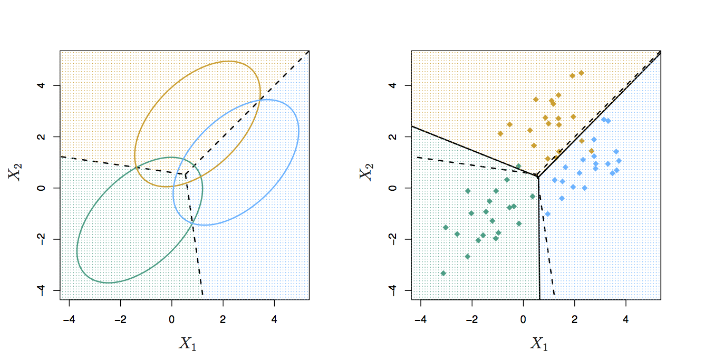

```{r setup, include=FALSE}

library(ISLR)

knitr::opts_chunk$set(echo = FALSE)
```

## Recap

* ISLR Chapter 4 is about classification
* We talked about logistic regression for binary outcomes
    + Can replace the sigmoid function with softmax for multi-class outcomes
* We implemented logistic regression using gradient descent
    + Optimizers other than GD can be used, e.g. Newton-Raphson
    + But remember there is no analytical solution!  Must search!

## Linear Discriminant Analysis

* Linear discriminant analysis is a generalization of Fisher's linear discriminant
* Related to analysis of variance (ANOVA) and regression analysis
    + Logistic regression and probit regression are also similar
    + Principal components analysis (PCA) and factor analysis are also similar
* Used for dimensionality reduction and classification
* Independent variables are continuous and dependent variable is categorical

## LDA, PCA, Dimensionality Reduction

* Today, we'll study LDA in the classification context
* Next couple of meetups we'll explore PCA and LDA in the context of *dimensionality reduction*
* LDA used more in dimensionality reduction context
    + PCA vs. LDA?
    + Synergy between PCA and LDA

## Classification

* Classification separates classes of observations
* Binomial or Multinomial
* Three general approaches to classification
    + Regression based (Logistic regression)
        + Use a threshold to map to "0 or 1"
    + Density based (LDA/QDA)
        + Estimate density for each class and use Bayes' rule
    + Empirical risk minimization (SVM? NN?)
        + "Find the one that minimizes error rate"

## Decision Boundary

* Concept of "separation of classes of observations"

$D(h) = \{x: P(y = 1 | X = x_0) = P(y = 0 | X = x_0)\}$

* $D(h)$ is called a "decision boundary"

$h(x_0) = 
\begin{cases}
1 & \text{if } P(y = 1 | X = x_0) > P(y = 0 | X = x_0) \\
0 & \text{otherwise}
\end{cases}$

## Bayes' Classifier

* Bayes' Rule

$P ( B_r | A ) = \frac { P ( B_r ) P ( A | B_r) } { \sum\limits_{ i = 1 }^k P ( B_i ) P( A | B_i) } \text{for } r = 1, 2, ... k$

* Bayes' classifier

$P( y = 1 | X = x_0) = \frac{P(X = x_0 | y = 1) P(y = 1)} { P(X = x_0) }$

* Posterior = (class conditional * prior) / marginal
* Bayes' classifier is optimal
    + Discussed this in chapter 2
* So why do we need to learn about other methods?

## Linear Discriminant Analysis (p = 1) {.smaller}

$P(Y = k | X = x) = \frac{\pi_k f_k(x)}{\sum\limits_{l = 1}^{k} \pi_l f_l(x)}$

* Assume we have one predictor (p = 1)
* Assume $f_k(x)$ is univariate *normal* or *Gaussian*

$f_k(x) = \frac{1}{\sqrt{2\pi}\sigma_k}exp(-\frac{(x - \mu_k)^2}{2\sigma_k^2})$

* Assume that $\sigma_1^2 = \ldots = \sigma_K^2$
    + Shared variance term across all $K$ classes ($\sigma^2$)
    
$p_k(x) = \frac{ \pi_k \frac{1}{\sqrt{2\pi}\sigma} exp(-\frac{(x - \mu_k)^2}{2\sigma^2}) }{\sum_{l = 1}^K \pi_l \frac{1}{\sqrt{2\pi}\sigma}exp(-\frac{(x - \mu_k)^2}{2\sigma^2})}$

## LDA (p = 1) cont. {.smaller}

* Simplifying the previous (take the log), we simplify to

$\delta_k(x) = x \frac{\mu_k}{\sigma^2} - \frac{\mu_k^2}{2\sigma^2} + log(\pi_k)$

```{r, out.width = 600, fig.retina = NULL, fig.align='center'}

```

* Bayes' decision boundary is:

$x = \frac{\mu_1^2 - \mu_2^2}{2(\mu_1 - \mu_2)} = \frac{\mu_1 - \mu_2}{2}$

## LDA Approximates Bayes' Classifier {.smaller}

* In practice, we have to estimate $\mu_1, \dots \mu_K, \pi_1, \dots \pi_K, \sigma^2$
* In *linear discriminant analysis* we approximate using the following estimates:

$\begin{align}
\hat\mu_k &= \frac{1}{n_k} \sum\limits_{i:y_i = k} x_i \\
\hat\sigma^2 &= \frac{1}{n - K} \sum\limits_{k = 1}^K \sum\limits_{i:y_i = k} (x_i - \hat\mu_k)^2
\end{align}$

* $n$ is the total number of training observations and $n_k$ is the number of training observations in the $k$th class
* $\hat\mu_k$ is the average of the training observations from the $k^{th}$ class
* $\hat\sigma^2$ is the weighted average of the sample variances for each of the K classes

$\hat\pi_k = n_k / n$

* $\hat\pi_k$ is the proportion of training observations that belong to the $k$th class

## Discriminant Function {.smaller}

* Plugging our estimates into the Bayes' classifier:

$\hat\delta_k(x) = x \frac{\hat\mu_k}{\hat\sigma^2} - \frac{\hat\mu_k^2}{2\hat\sigma^2} + log(\hat\pi_k)$

* Called *discriminant functions* and are linear in x
    + Hence, linear discriminant analysis

```{r, out.width = 400, fig.retina = NULL, fig.align='center'}

```

* Bayes' error rate is 10.6% and LDA error rate is 11.1%, difference of 0.5% above smallest possible error rate!

## Multivariate Gaussian Distribution {.smaller}

* $X = (X_1, X_2, ..., X_p)$ is drawn from a *multi-variate Gaussian* distribution
* Class-specific mean vector and common covariance matrix

```{r, out.width = 400, fig.retina = NULL, fig.align='center'}

```

* The height of the surface at any particular point represents the probability that both X1 and X2 fall in a small region around that point
* Left panel, $Var(X1) = Var(X2)$ and $Cor(X1,X2) = 0$
* Right panel, variances differ

## Multivariate Gaussian Distribution (cont.)

* We indicate that p-dimensional random variable $X$ has a multivariate Gaussian distribution by writing:

$X \sim N(\mu, \Sigma)$

* $E(X) = \mu$ is the mean of $X$, a vector with p components
* $Cov(X) = \Sigma$ is the $p \times p$ covariance matrix of $X$
* Multivariate Gaussian density is defined as:

$f(x) = \frac{1}{(2\pi)^{p/2}|\Sigma|^{1/2}} \text{exp}(-\frac{1}{2}(x - \mu)^T \Sigma^{-1}(x - \mu))$

## LDA (p > 1)

* Assumes observations from the $k^{th}$ class are drawn from a multivariate Gaussian distribution $N(\mu_k, \Sigma)$
    + $\mu_k$ is a class-specific mean vector
    + $\Sigma$ is a covariance matrix that is common to all K classes
* Plugging the density function for the $k^{th}$ class $f_k(X = x)$ into the equation for Bayes' theorem, the Bayes' classifier assigns an observation $X = x$ to the class for which 

$\delta_k(x) = x^T \Sigma^{-1} \mu_k - \frac{1}{2} \mu_k^T \Sigma^{-1} \mu_k + log \pi_k$

is largest.

## LDA Decision Boundary {.smaller}

* The decision boundary is the set of values $x$ where $\delta_k(x) = \delta_l(x)$:

$x^T \Sigma^{-1} \mu_k - \frac{1}{2} \mu_k^T \Sigma^{-1} \mu_k = x^T \Sigma^{-1} \mu_l - \frac{1}{2} \mu_l^T \Sigma^{-1} \mu_l$

```{r, out.width = 400, fig.retina = NULL, fig.align='center'}

```

* In the left panel, 3 ellipses represent 95% of probability for each class, there are three Bayes decision lines
* In the right panel, the LDA decision boundaries are the solid lines and are close to the Bayes decision lines
* Test error rates for the Bayes and LDA classifiers are 0.0746 and 0.0770 respectively

## Quadratic Discriminant Analysis {.smaller}

* LDA assumes that observations within each class are drawn from a multivariate Gaussian distribution with a class-specific mean vector and a covariance matrix common to K classes
* *Quadratic Discriminant Analysis* (QDA) is like LDA but drops the assumption of a common covariance matrix
* An observation from the $K^{th}$ class is assumed to be of the form $X \sim N(\mu_k, \Sigma_k)$
    + $\Sigma_k$ is the covariance matrix for the $K^{th}$ class

* QDA

$\delta_k(x) = -\frac{1}{2} x^T \Sigma_k^{-1} x + x^T \Sigma_k^{-1} \mu_k - \frac{1}{2} \mu_k^T \Sigma_k^{-1} \mu_k - \frac{1}{2} log | \Sigma_k | + log \pi_k$

* Compared to LDA

$\delta_k(x) = x^T \Sigma^{-1} \mu_k - \frac{1}{2} \mu_k^T \Sigma^{-1} \mu_k + log \pi_k$

* In QDA, $x$ appears as a quadratic function, hence the name


## LDA vs. QDA, Bias-Variance Tradeoff

* LDA is linear in X, so is a much less flexible classifier
    + Has a much lower variance
    + This can lead to improvied prediction performance
* If the assumption of common covariance matrix among K classes if off?
    + LDA can suffer from high bias
* LDA is better when there are relatively few training observations
    + And so reducing variance is crucial
* QDA is recommended if the training set is very large
    + Variance of the classifier is not a major concern
* QDA is recommended if the common covariance matrix for the K classes is untenable
    
## Comparing LDA and QDA

```{r, out.width = 400, fig.retina = NULL, fig.align='center'}

```

* In the left panel, the Bayes' decision boundary is linear, so LDA is a more accurate approximate
    + Data was generated with $\Sigma_1 = \Sigma_2$
* In the right panel, the Bayes' decision boundary is non-linear, so QDA is a better classifier
    + Data was generated with $\Sigma_1 \neq \Sigma_2$

