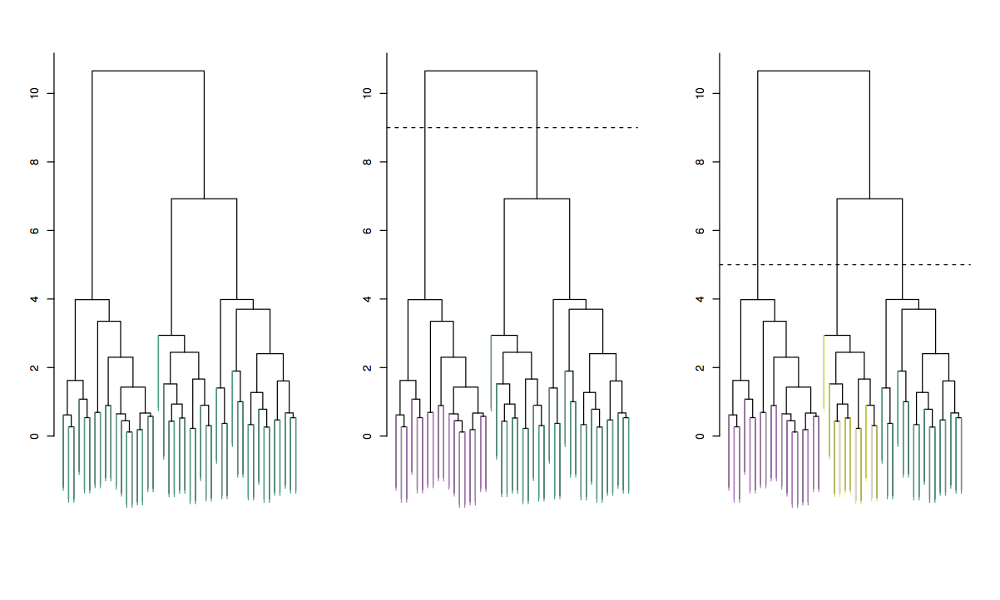
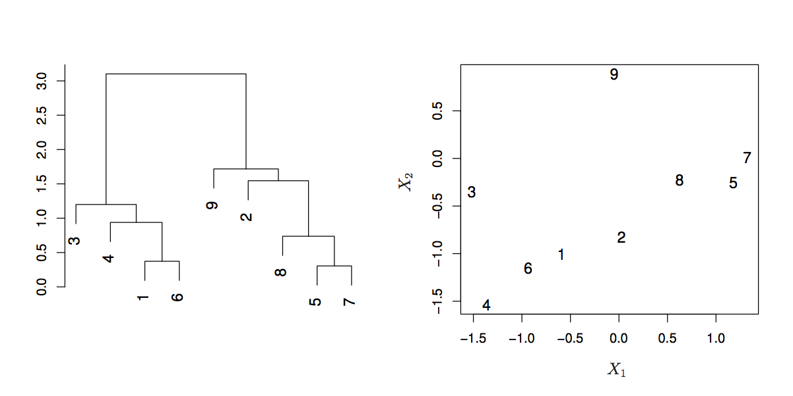
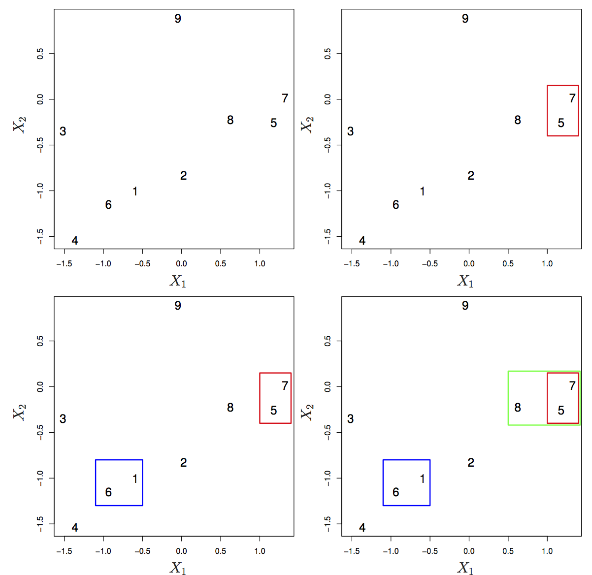
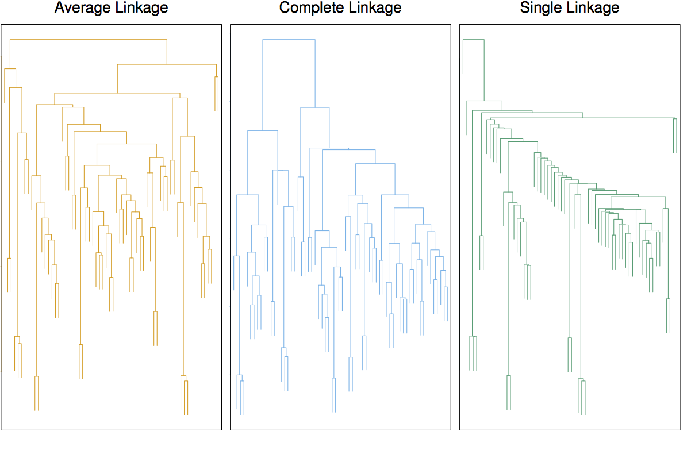
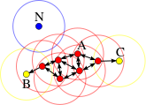

<style>
.title-slide {
  background-color: #FFFFFF; /* #EDE0CF; ; #CA9F9D*/
}
slide:not(.segue) h2 {
  color: #800000
}
slide pre code {
  font-size: 11px ;
}
slide.linkage li {
  font-size: 80%;
}
slide.eighty li {
  font-size: 80%;
}
</style>

```{r setup, include=FALSE}
knitr::opts_chunk$set(echo = TRUE)
```

## Supervised Learning

* We need *labeled* samples for our learning algorithms
    + $Z = \{x^i, y^i\}_{i=1}^N$
* We choose a hypothesis and *train* a model from our labeled samples
* We can assess our results for a model using cross-validation or a validation set
    + We have labels and we can check our results against those labels

---
## Unsupervised Learning

* We *don't* have labeled data (no **ground truth**)
    + $Z = \{x^i\}_{i=1}^N$
* Much more challenging
    + Hard to assess results, we can't *check our work*
* Goals
    + Exploratory -- We're *not* making predictions!
    + Preprocessing -- Drives further analysis
* Forward thinking
    + Remember our iris classification problem from last time.  Can we predict?  What's the difference?

--- &twocol
## Classes vs. Clusters

*** =left

- Supervised: Z = $\left\{\mathbf{x}^t, \mathbf{r}^t\right\}_t$
- Classes $C_i, i = 1, \dots, K$
$p(\mathbf{x}) = \sum\limits_{i=1}^K p(\mathbf{x} | C_i)P(C_i)$
$\text{where} \enspace p(\mathbf{x} | C_i) \sim N(\boldsymbol{\mu}_i, \boldsymbol{\Sigma}_i)$
- $\Phi = \left\{P(C_i), \boldsymbol{\mu}_i, \boldsymbol{\Sigma}_i\right\}_{i=1}^K$
$\hat{P}(C_i) = \frac{\sum_t r_i^t}{N} \enspace \mathbf{m}_i = \frac{\sum_t r_i^t \mathbf{x}^t}{\sum_t r_i^t}$
$\mathbf{S}_i = \frac{ \sum_t r_i^t(\mathbf{x}^t - \mathbf{m}_i)(\mathbf{x}^t - \mathbf{m}_i)^T }{\sum_t r_i^t}$

*** =right

- Unsupervised: Z = $\left\{\mathbf{x}^t\right\}_t$
- Clusters $G_i, i = 1, \dots, k$
$p(\mathbf{x}) = \sum\limits_{i=1}^k p(\mathbf{x} | G_i)P(G_i)$
$\text{where} \enspace p(\mathbf{x} | G_i) \sim N (\boldsymbol{\mu}_i, \boldsymbol{\Sigma}_i)$
- $\Phi = \left\{P(G_i), \boldsymbol{\mu}_i, \boldsymbol{\Sigma}_i\right\}_{i=1}^k$

Labels $\mathbf{r}_i^t$?

---
## K-Means Clustering

Let $C_1, \dots, C_K$ denote sets containing the indices of the observations in each cluster.  These sets satisfy two properties:

1. $C_1 \cup C_2 \cup \dots \cup C_K = \left\{1, \dots, n\right\}$. In other words, each observation belongs to at least one of the $K$ clusters.
2. $C_k \cap C_k^{'} = \emptyset$ for all $k \neq k^{'}$.  In other words, the clusters are non-overlapping: no observation belongs to more than one cluster.

* Note that k-means is a *hard* clustering.  A datapoint belongs to one cluster only.  Contrast this with GMM where you have a probability distribution for belonging to all clusters.

* For K-Means, we want to parition the data points into $K$ clusters such that the within-cluster variation is minimized over all clusters.

$\min\limits_{C_1, \dots, C_K}\left\{ \sum\limits_{k=1}^K \frac1{|C_k|} \sum\limits_{i,i^{'} \in C_k} \sum\limits_{j=1}^p (x_{ij} - x_{i^{'}j})^2 \right\}$

---
## K-Means Algorithm

* We need an algorithm to solve the previous minimization problem, but this is very difficult!
* A simple heuristic provides a local optimum that works well

1. Randomly assign a number, from 1 to $K$, to each of the observations.  These serve as the initial cluster assignments for the observations.

2. Iterate until the cluster assignments stop changing:

    (a) For each of the $K$ clusters, compute the cluster *centroid*.  The $k$th cluster centroid is the vector of the $p$ feature means for the observations in the $k$th cluster.

    (b) Assign each observation to the cluster whose centroid is the closest (where *closest* is defined using Euclidean distance).

---
## K-Means Considerations

* You need to select $K$, the number of clusters, ahead of running the algorithm.  The problem of selecting $K$ is not easy!

* Because the K-Means algorithm finds a local rather than a global optimum, the results obtained depend on the initial cluster assignments.  So it is important to run K-Means multiple times with different random initial state.

* Rather than assigning data points to clusters initially, you can play with assigning the centroids in different ways for the initial state.  This also has the same problem of finding a local minimum, but can lead to more determinate runs of the algorithm.

* K-Means suffers from a number of degenerate issues.  We will explore this in the demo.  Be aware that there are some opinions that say that K-Means needs to be used very carefully.

---
## TODO
Mention other uses, quantization/compression

---
## Expectation Maximization

* K-Means is a special case of EM using Gaussian mixture models

---
## Hierarchical Clustering

* Don't need to specify $K$ ahead of time
* Agglomerative vs. Divisive
    + In agglomerative clustering each data point starts in it's own cluster and you group them based on similarity
    + In divisive clustering, start with one big cluster and split based on similarity until each data point is in its own cluster
* Tree-based representation called a *dendogram*

--- &twocol
## Dendogram

* As we move up the tree, some leaves begin to *fuse* into branches
* The earlier fusions occur, the more similar the groups are to each other
* Observations that fuse later can be quite different
* We can't draw conclusions about the similarity of two observations based on their proximity along the *horizontal axis*.  We need to draw conclusions about similarity based on the location on the *vertical axis* where branches containing those observations are first fused.

*** =left


*** =right



--- &twocol .eighty
## Hierarchical Clustering Algorithm

*** =left

* To start, each observation is treated as its own cluster
* Then iteratively, fuse the two clusters that are most similar
* Proceed until there is one big cluster
* One issue, we can define dissimilarity between single observations, but we need to also define it for groups of observations
  + Define *linkage* for dissimilarity between groups of observations

*** =right




--- &twocol .linkage
## Linkage

*** =left



*** =right

* Complete
  + Maximal intercluster dissimilarity.
  + Record the largest of all pairwise dissimilarities.
* Single
  + Minimal intercluster dissimilarity
  + Record the smallest of all pairwise dissimilarities.
  + Can lead to extended, trailing clusters in which single observations are fused one-at-a-time
* Average
  + Mean intercluster dissimilarity.
  + Record the average of all pairwise dissimilarities
* Centroid
  + Dissimilarity between the centroid of two clusters
  + Can result in undesirable *inversions*


---
## Choice of Dissimilarity Measure

* Euclidian distance
* Squared Euclidian distance
* Manhattan distance
* Maximum distance
* Mahalanobis distance
* Correlation-based distance
    + Online retailer clustering shoppers example
    + If you preprocess your data to be $\mu = 0$ and $\sigma = 1$, you can use squared Euclidian distance

---
## Comparison with K-Means

* Don't need to know $K$ *beforehand*.  From one dendogram you can choose the best *cut* where the height of the cut serves the same purpose as $K$ in K-Means.
* The hierarchical structure may not be a good assumption for some sorts of data.  Example from ISLR, 50-50 split of male/female into 3 nationalities.  The true clusters may not be nested.

---
## Considerations When Using Hierarchical Clustering

* What dissimilarity measure should be used?
* What linkage should be used?
* Where should we cut the dendogram?
* Should the data be scaled before-hand?

---
## Density-based Clustering

* Clusters are regions of higher density in the data space separated by regions of lower density
* A cluster is defined as a maximal set of density-connected points
* Can discover clusters of arbitrary shape

---
## DBSCAN

* Core points are density reachable to other points
* Border points are not density reachable *to* other points, but may be density reachable *from* other points
* Noise points are not density reachable to or from any points



By Chire - Own work, CC BY-SA 3.0, https://commons.wikimedia.org/w/index.php?curid=17045963


--- &twocol .eighty
## DBSCAN Pros and Cons

*** =left

Advantages

* Don't need to know the number of clusters a-priori
* Can find arbitrarily shaped clusters
* Robust to outliers, notion of noise
* Requires just two parameters (minPts and $\epsilon$)

*** =right

Disadvantages

* Not entirely deterministic, order of processing data points can affect border points
* Quality depends on the distance measure used
* Cannot cluster well with large differences in densities since minPts and $\epsilon$ are global parameters


---
## Latent Dirichlet Allocation (LDA)


---
## Clustering Considerations

* Should the observations or features first be standardized in some way?
