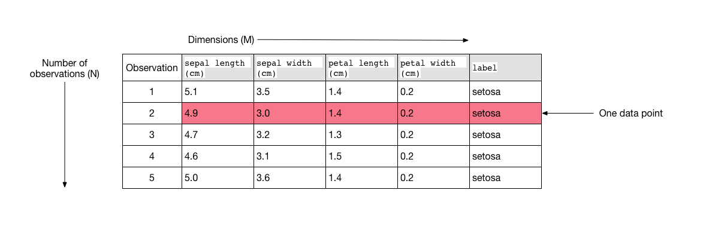
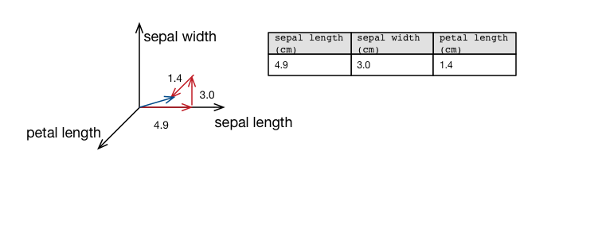
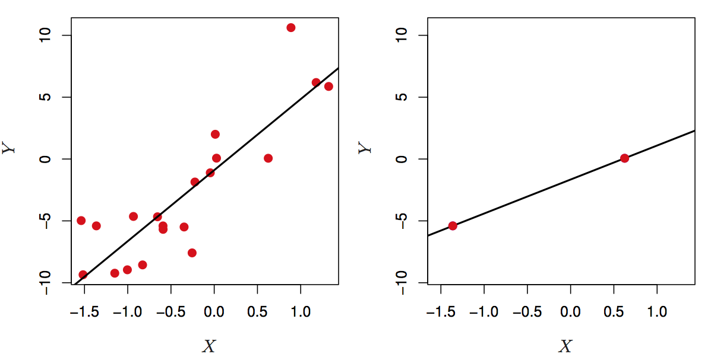
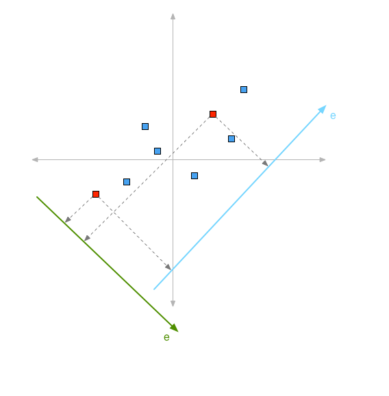
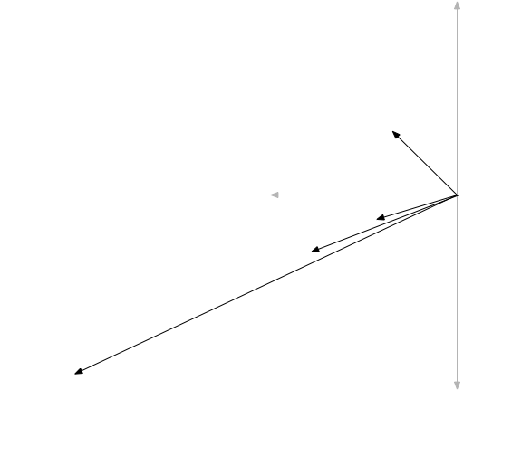
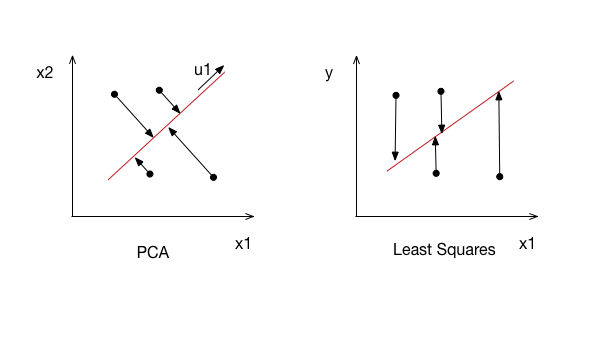
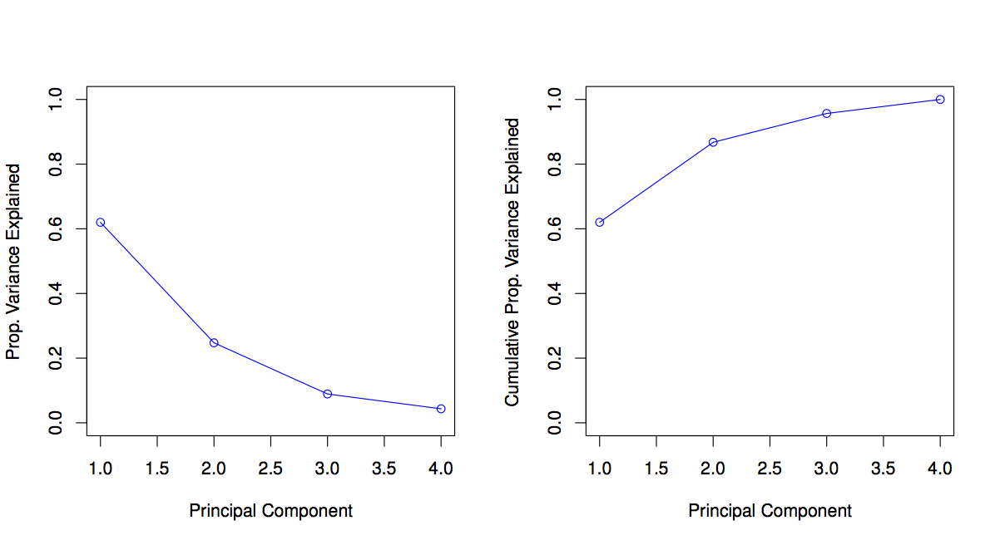

<style>
.title-slide {
  background-color: #FFFFFF; /* #EDE0CF; ; #CA9F9D*/
}
slide:not(.segue) h2 {
  color: #800000
}
slide pre code {
  font-size: 11px ;
}
slide.linkage li {
  font-size: 80%;
}
slide.eighty li {
  font-size: 50%;
}
slide.eighty {
  font-size: 50%;
}
img[alt=dimensionality] {
  width: 800px;
}
img[alt=high-dimensionality] {
  width: 400px;
}
img[alt=greatest-variability] {
  width: 400px;
}
img[alt=mult-cov-matrix] {
  width: 400px;
}
img[alt=orthogonal-projection] {
  width: 500px;
}
img[alt=scree] {
  width: 600px;
}
</style>

```{r setup, include=FALSE}
knitr::opts_chunk$set(echo = TRUE)
```

## Definition of Dimensionality

* What do we mean by *dimensionality*?



* N is the number of observations, M is the number of features
* Dimensionality is the number of features
    + Think of it as the number of coordinates for a data point
* A dataset is an N x M matrix in the feature space $\mathbb{R}^M$

---
## Definition of Data Point


* A data point is a vector in M dimensional space
    - The blue vector represents the data point (4.9, 3.0, 1.4) in M = 3 dimensional space ($\mathbb{R}^3$)
    - Our three dimensions are "sepal length," "sepal width," and "petal length"
* Our dataset is made up of N of these data points or vectors

--- &twocol
## What Goes Wrong in High Dimensions?

*** =left

* Linear regression is not intended for the high-dimensional setting!
* When $M \geq N$ you get a perfect fit to the data
    - This won't generalize well
    
*** =right



---
## The Curse of Dimensionality

As we add more features, the dimensionality of the feature space grows, leading to the data points becoming increasingly more sparse.  In this high dimensional space, it is easier to find a separating hyperplane.  Unless the added features (hence, increasing dimensionality) are *signal* features and not *noise* features, overfitting can occur and generalization of the model will suffer.  Even if the features are relevant, the variance incurred may outweigh the reduction in bias that they bring.

* The number of observations needed grows exponentially with the number of dimensions used
    + The smaller the size of the training set, the fewer dimensions should be used
* For a good visualization of the curse of dimensionality, see:

http://www.visiondummy.com/2014/04/curse-dimensionality-affect-classification/

---
## Dimensionality Reduction

* Why?
    + Complexity usually depends on N and M.  Reducing M can lead to reduced memory and computation
    + When an input is deemed unnecessary, we save the cost of extracting it
    + Simpler models are more robust on small datasets, have less variance
    + Fewer features can lead to more easily understanding the underlying process that created the data
    + Visual analysis is possible if reduction doesn't lose information
* Two main methods
    + Feature selection
    + Feature extraction

---
## Feature Selection

* A common approach is *subset selection*
* The best subset contains the fewest number of features that most contribute to accuracy
* Two main approaches
    + Forward Selection
    + Backward Selection
* Wrapper approach
    + Start with no features, find first that adds least error, continue adding until error is not decreased
    + "wraps"" around the learner as a subroutine
* Feature selection is more subtle than it seems!

---
## Feature Extraction

* Want to find a new set of $k$ dimensions that are combinations of the original set of $d$ dimensions
* May be supervised or unsupervised depending on whether or not they use the labels
* Best know algorithms are *Principal Component Analysis* and *Fisher's Linear Discriminant Analysis*
    + Both of which are linear projection methods
    + Unsupervised and supervised respectively
* Other unsupervised algorithms
    + Factor Analysis
    + Multidimensional Scaling
    + Canonical Correlation Analysis
    + More ...

---
## Principal Component Analysis

* Principal Component Analysis (PCA) is a feature extraction method for dimensionality reduction
* PCA is an unsupervised technique -- labels need not apply!
* Summarize a correlated set of variables that explains most of the variability in the original set
* Produces a set of derived values for a supervised learning problem
* Can be used in data analysis for visualization

--- .eighty
## What are Principal Components?

The projection of $\mathbf{x}$ on the direction of $\mathbf{w}$ is

$$z = \mathbf{w}^T\mathbf{x}$$

The criterion to be maximized is the variance

$$Var(z_1) = \mathbf{w}_1^T \Sigma \mathbf{w_1}$$

We seek $\mathbf{w}_1$ such that $Var(z_1)$ is maximized subject to the constraint that $\mathbf{w}_1^T\mathbf{w}_1 = 1$. To solve this, we write it as a Lagrange problem

$$\max_{\mathbf{w}_1} \mathbf{w}_1^T \Sigma \mathbf{w}_1 - \alpha ( \mathbf{w}_1^T \mathbf{w}_1 - 1)$$
Taking the derivative, setting it equal to zero and simplifying, we end up with

$$\Sigma\mathbf{w}_1 = \alpha \mathbf{w}_1 $$

which is true when $\mathbf{w}_1$ is an eigenvector of $\Sigma$ and $\alpha$ the corresponding eigenvalue

---
## Principal Components

* Therefore the first principal component is the eigenvector of the covariance matrix of the data with the largest eigenvalue.  To find subsequent principal components is similar, but we require the subsequent principal components to be orthogonal to all previous principal components so that they are uncorrelated.

$$\max_{\mathbf{w_2}} \mathbf{w}_2^T \Sigma \mathbf{w}_2 - \alpha (\mathbf{w}_2^T \mathbf{w}_2 - 1) - \beta(\mathbf{w}_2^T\mathbf{w}_1 - 0)  $$

This eventually reduces to

$$\Sigma \mathbf{w}_2 = \alpha\mathbf{w}_2 $$
Implying that $\mathbf{w}_2$ should be the eigenvector of $\Sigma$ with the second largest eigenvalue

---
## Principal Component Analysis Definition

The first principal component explains the largest part of the variance and subsequent principal components explain the next largest part of the variance, etc.

So, we define

$$ \mathbf{z} = \mathbf{W}^T(\mathbf{x} - \mathbf{m}) $$

where the $k$ columns of $\mathbf{W}$ are the $k$ leading eigenvectors of $\mathbf{S}$, the estimator for $\Sigma$.  Before projection, we center the data by subtracting the sample mean from each datapoint.

* $\mathbf{z}$ becomes our new dataset

---
## PCA Algorithm
With $\mathbf{z} = \mathbf{W}^T(\mathbf{x} - \mathbf{m})$ in mind:

1. Form the covariance matrix $\mathbf{S}$ of our dataset
2. Perform an eigendecomposition of $\mathbf{S}$
3. Sort the eigevectors based on their eigenvalues from highest to lowest
4. Take $d << k$ eigenvectors to form a transformation matrix $\mathbf{W}$ to a lower dimensional space
5. Mean center your data and transform it by $\mathbf{W}$ into $\mathbf{z}$
6. Use $\mathbf{z}$ as your new dataset

---
## Two Interpretations

* Directions in feature space along which the data vary the most
* Low dimensional linear surfaces that are *closest* to the observations
* Both can be described as the best way to preserve distances between data points
* The usual interpretation is as a projection to a lower dimensional subspace of the data
* "Can be defined as the orthogonal projection of the data onto a lower dimensional linear space ... such that the variance of the projected data is maximized."

--- &twocol
## PCA Intuition - Maximizing Variance

*** =left

* PCA finds a low dimensional subspace where variance is maximized
* "Minimizes" cases where points are far apart in the original space but close together when projected
* Minimizes distance between datapoints and their projections

*** =right



--- &twocol
## PCA Intuition - Multiply by $\Sigma$

*** =left

* If we multiply our datapoints by $\Sigma$, our covariance matrix:

$$
\begin{bmatrix}
    2.0 & 0.8 \\
    0.8 & 0.6 \\
\end{bmatrix}
\begin{bmatrix}
    -1 \\
    1 \\
\end{bmatrix}
\rightarrow
\begin{bmatrix}
    -1.2 \\
    -0.2 \\
\end{bmatrix}
$$

Multiplying that result by $\Sigma$ again and again and again, you get:

$$
\begin{bmatrix}
    -2.5 \\
    -1.0 \\
\end{bmatrix}
\rightarrow
\begin{bmatrix}
    -6.0 \\
    -2.7 \\
\end{bmatrix}
\rightarrow
\begin{bmatrix}
    -14.1 \\
    -6.4 \\
\end{bmatrix}
\rightarrow
\begin{bmatrix}
    -33.3 \\
    -15.1 \\
\end{bmatrix}
$$

* Any vector in the dataset multiplied by $\Sigma$ rotates the vector towards the eigenvector with the largest eigenvalue.

*** =right




---
## PCA Intuition - Orthogonal Projection


* PCA projects data points onto the line that maximizes the variance of the data points
    + The projection is an orthongal projection -- shortest distance between point and "line"
* Least-squares fits a line by minimizing the sum of the squared residuals
    + Residuals are the difference between the predicted value and the actual value
* Both are cool problems in pure linear algebra!

---
## Scaling the variables

* Before performing PCA, we already know that we have to mean-center our data
* A consideration to be made is whether you need to scale your data
    + In linear regression, scaling has no effect
    + Consider if your features are measured in different units and scale if so

---
## Proportion of Variance Explained

* In PCA we are trying to reduce our feature space from a high dimensional feature space $d$ to a lower dimensional feature space $k$
* The eigenvalues are the variance for their corresponding eigenvectors
* So we can determine how much of the variance is explained by the $k$ eigenvectors by using the eigenvectors corresponding to the $k$ largest eigenvalues and the proportion of variance explained is

$$\frac{\lambda_1 + \lambda_2 + \dots + \lambda_k}{\lambda_1 + \lambda_2 + \dots + \lambda_k + \dots + \lambda_d}$$

* If the dimensions are highly correlated, there will be a small number of eigenvectors with large eigenvalues and $k << d$, so a large reduction in dimensionality will be attained.

---
## Deciding How Many Principal Components to Use

* A scree graph can help you visually decided how many principal components to use
* For each principal component, plot the proportion of variance explained
* Can also use a cumulative plot for proportion of variance explained




---
## Reconstruction Error

* When $\mathbf{W}$ is an orthogonal matrix such that $\mathbf{W}\mathbf{W}^T = \mathbf{I}$, a datapoint can be back-projected to the original space as

$$\hat{\mathbf{x}}^t = \mathbf{W}\mathbf{z}^t + \boldsymbol{\mu} $$

* $\hat{\mathbf{x}}^t$ is the reconstruction of $\mathbf{x}^t$ from its representation in z-space.
* PCA minimizes the *reconstruction error*, which is the distance between the instance and its reconstruction from the lower-dimensional space:

$$\sum_t || \mathbf{x}^t - \hat{\mathbf{x}}^t ||^2 $$

* If we discard some eigenvectors with non-zero eigenvalues, there will be a reconstruction error.
* In a visual recognition application, e.g. face recognition, displaying $\hat{\mathbf{x}}^t$ allows a visual check for information loss during PCA

---
## Further Study

* PCA is typically performed using Singular Value Decomposition (SVD), another amazing linear algebra technique!
    + More accurate and efficient than eigendecomposition
* Other related techniques
    + Factor Analysis
    + Multidimensional Scaling
    + Fisher's Linear Discriminant Analysis
    + Canonical Correlation Analysis

---
## References

* Alpaydin, E. (2014). Introduction to Machine Learning, Third Edition. Massachusetts: The MIT Press.
* James, G., Witten, D., Hastie, T., Tibshirani, R. (2015). An Introduction to Statistical Learning with Applications in R, Sixth Printing. New York: Springer.
Lavrenko, V. (2014). Principal Component Analysis. https://www.youtube.com/playlist?list=PLBv09BD7ez_5_yapAg86Od6JeeypkS4YM

